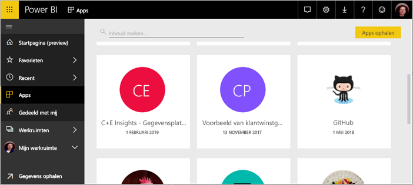
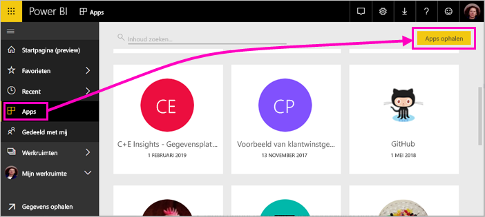
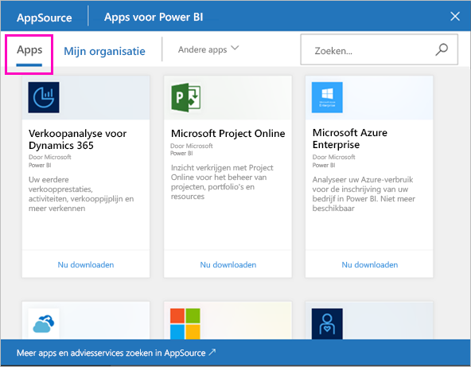
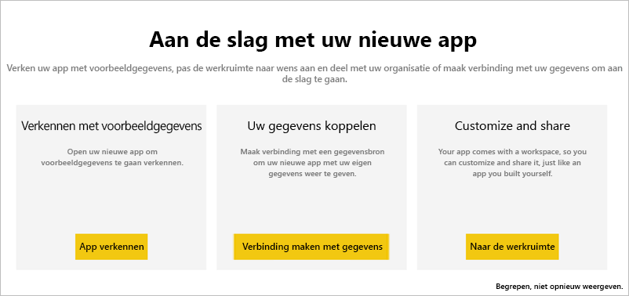
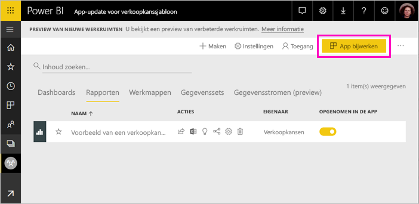
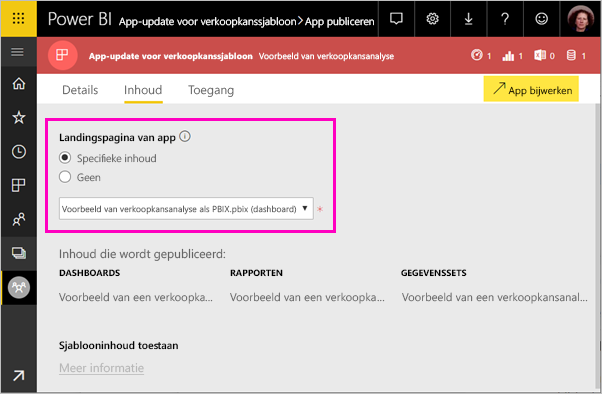

# Sjabloon-apps in uw organisatie installeren en distribueren - Power BI (preview-versie)

Bent u een Power BI-analist? In dat geval leest u in dit artikel hoe u *sjabloon-apps* installeert om in verbinding te komen met de vele services waarmee u uw bedrijfsactiviteiten uitvoert, zoals Salesforce, Microsoft Dynamics en Google Analytics. U kunt het dashboard en de rapporten aanpassen om aan de behoeften van uw organisatie te voldoen en deze vervolgens als *app* naar uw collega's distribueren. 

Zie [Een sjabloon-app maken in Power BI](service-template-apps-create.md) als u meer wilt weten over het maken van sjabloon-apps die u zelf kunt distribueren. Power BI-partners kunnen Power BI-apps bouwen met weinig of geen code en deze implementeren naar Power BI-klanten. 

## Vereisten  

Dit zijn de vereisten voor het installeren, aanpassen en distribueren van een sjabloon-app: 

- Een [Power BI Pro-licentie](service-self-service-signup-for-power-bi.md)
- Vertrouwd zijn met de [basisconcepten van Power BI](service-basic-concepts.md)
- Een geldige koppeling voor de installatie van de maker van de sjabloon-app of AppSource. 
- Machtigingen voor het installeren van sjabloon-apps. 

## Een sjabloon-app installeren

U ontvangt mogelijk een koppeling naar een sjabloon-app. Als dit niet het geval is, kunt u in AppSource zoeken naar een sjabloon-app waarin u bent geïnteresseerd. Nadat u de sjabloon-app hebt geïnstalleerd, kunt u deze wijzigen en naar uw eigen organisatie distribueren.

### In AppSource zoeken vanuit een browser

Selecteer in een browser deze koppeling om AppSource te openen, waarbij is gefilterd op Power BI-apps:

- https://appsource.microsoft.com/marketplace/apps?product=power-bi

### In AppSource zoeken vanuit de Power BI-service

1. Selecteer in de Power BI-service in het navigatiedeelvenster aan de linkerkant **Apps** > **Apps ophalen**.

    

2. Selecteer in AppSource **Apps**.

    

3. Blader of zoek de app en selecteer vervolgens **Nu downloaden**.

2. Selecteer **Installeren** in het dialoogvenster.

    Als u een Power BI Pro-licentie hebt, wordt de app geïnstalleerd met de bijbehorende app-werkruimte. U past de app aan in de bijbehorende werkruimte.

    Wanneer de installatie is geslaagd, ziet u een melding dat uw nieuwe app gereed is. 

3. Selecteer **Naar de app**.
4. Selecteer in **Aan de slag met uw nieuwe app**  een van de volgende drie opties:

    

    - **App verkennen**: De voorbeeldgegevens verkennen. Begin hier om het uiterlijk en de werking van de app te zien. 
    - **Verbinding maken met gegevens**: Vervang de gegevensbron van de voorbeeldgegevens door uw eigen gegevensbron. U kunt de parameters van de gegevensset en de referenties van de gegevensbron opnieuw definiëren. Zie [Bekende beperkingen](service-template-apps-tips.md#known-limitations) in het artikel met tips voor sjabloon-apps. 
    - **Naar de werkruimte** (meest geavanceerde optie): u kunt wijzigingen aanbrengen die door de ontwikkelaar van de app zijn toegestaan.

    U kunt dit dialoogvenster ook overslaan en direct de bijbehorende werkruimte openen via **Werkruimten** in het navigatiedeelvenster aan de linkerkant.   
 
5. Voordat u de app met uw collega's deelt, kunt u verbinding maken met uw eigen gegevens. U kunt ook het rapport of dashboard wijzigen, zodat dit geschikt is voor uw organisatie. Ook kunt u hier andere rapporten of dashboards toevoegen.

## De app bijwerken en distribueren

Nadat u de app voor uw organisatie hebt bijgewerkt, kunt u de app publiceren. De stappen hiervoor zijn dezelfde als voor het publiceren van andere apps. 

1. Wanneer u klaar bent met het aanpassen van de app, selecteert u **App bijwerken** in de rechterbovenhoek in de lijstweergave van de werkruimte.  

    

2. In **Details** kunt u de beschrijving en achtergrondkleur wijzigen.

   

3. In **Inhoud** kunt u een landingspagina selecteren. Dit is het dashboard of het rapport.

   

4. In **Toegang** geeft u toegang aan geselecteerde gebruikers of aan de hele organisatie.  

   

5. Selecteer **App bijwerken**. 

6. Nadat de app is gepubliceerd, kunt u de koppeling kopiëren en delen met degenen die u toegang hebt gegeven. Als u de app met hen hebt gedeeld, zien zij de app ook op het tabblad **Mijn organisatie** in AppSource.

## Volgende stappen 

[Werkruimten maken met uw collega's in Power BI](service-create-workspaces.md)

 

 
