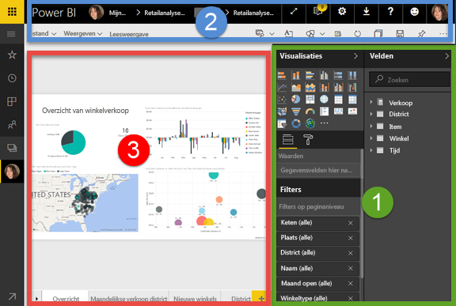
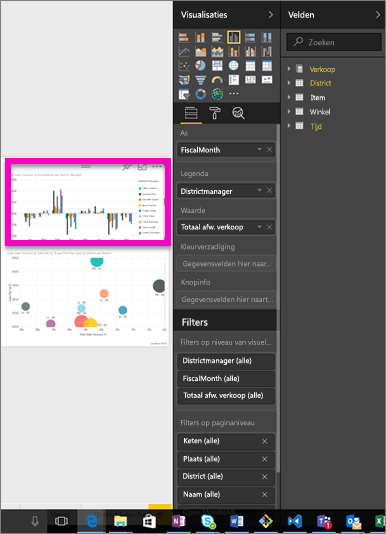
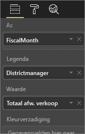
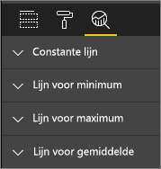
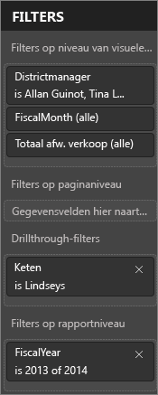

# De rapporteditor... Een rondleiding
De rapporteditor in de Power BI-service en de rapporteditor in Power BI Desktop zijn vergelijkbaar. In de video ziet u de rapporteditor in Power BI Desktop en in dit artikel ziet u de rapporteditor in de Power BI-service. 

<iframe width="560" height="315" src="https://www.youtube.com/embed/IkJda4O7oGs" frameborder="0" allowfullscreen></iframe>

In de Power BI-service is de *rapporteditor* alleen beschikbaar in de [Bewerkweergave](service-reading-view-and-editing-view.md). Als u een rapport in Bewerkingsweergave wilt openen, moet u de eigenaar van het rapport zijn.

De Power BI-rapporteditor bestaat uit 3 secties:  

1. de deelvensters **Velden**, **Visualisaties** en **Filters**
2. bovenste navigatiebalken    
3. rapportcanvas     

## 1. De deelvensters van de rapporteditor

U ziet drie deelvensters wanneer u een rapport opent: Visualisaties, Filters en Velden. De deelvensters aan de linkerkant, Visualisaties en Filters, bepalen hoe uw visualisaties eruitzien (type, kleuren, filters, opmaak).  En het deelvenster aan de rechterkant, Velden, beheert de onderliggende gegevens die worden gebruikt in de visualisaties. 

De inhoud die wordt weergegeven in de rapporteditor, hangt af van de selecties die u in het rapportcanvas maakt.  Wanneer u bijvoorbeeld een afzonderlijk visueel element selecteert, 

|  |  |
| --- | --- |
|  |<ul><li>De bovenkant van het deelvenster Visualisatie identificeert het type visuele element dat wordt gebruikt; in dit voorbeeld een gegroepeerd kolomdiagram.  </li> <li>Onder in het deelvenster Visualisatie (mogelijk moet u omlaag schuiven) worden de velden weergegeven die in het visuele element worden gebruikt. In deze grafiek worden FiscalMonth, DistrictManager en Total Sales Variance gebruikt.   </li><li>Het deelvenster Filters (mogelijk moet u omlaag schuiven) geeft de filters weer die zijn toegepast.   </li><li>In het deelvenster Velden vindt u de beschikbare tabellen en, als u de naam van een tabel uitvouwt, de velden waaruit deze tabel bestaat. Het gele lettertype laat u weten dat ten minste één veld uit deze tabel wordt gebruikt in de visualisatie.  </li><li>Selecteer het pictogram van de verfroller om het opmaakvenster weer te geven voor de geselecteerde visualisatie.  </li><li>Als u het deelvenster Analyse wilt weergeven, selecteert u het vergrootglaspictogram.</ul> |
|  | |

## Het deelvenster Visualisaties (van boven naar beneden)

Hier selecteert u een type visualisatie. De kleine afbeeldingen worden *sjablonen* genoemd. In de afbeelding hiervoor is de staafdiagram Gegroepeerd geselecteerd. Als u niet eerst een type visualisatie selecteert, maar een visualisatie gaat samenstellen door velden te selecteren, kiest Power BI het type visualisatie voor u. U kunt de selectie van Power BI behouden, maar u kunt het type ook wijzigen door een andere sjabloon te selecteren. Verander zo vaak als u wilt om het type visualisatie te vinden dat het beste bij uw gegevens past.

### Beheer de velden die in uw visuele element worden gebruikt.

De buckets (soms ook wel *wells* genoemd) die in dit deelvenster worden weergegeven, zijn afhankelijk van het type visualisatie dat u hebt geselecteerd.  Als u bijvoorbeeld een staafdiagram hebt geselecteerd, ziet u buckets voor Waarden, As en Legenda. Wanneer u een veld selecteert, of naar het canvas sleept, voegt Power BI dat veld toe aan een van de buckets.  U kunt ook velden uit de lijst Velden rechtstreeks in de buckets slepen.  Sommige buckets zijn beperkt tot bepaalde typen gegevens.  **Waarden** accepteert bijvoorbeeld geen niet-numerieke velden. Dus als u een veld **naamwerknemer** naar de bucket **Waarden** sleept, verandert Power BI dit in **aantal naamwerknemer**.

### Een veld verwijderen
Als u een veld wilt verwijderen uit de visualisatie, selecteert u de **X** rechts van de veldnaam.

Zie [Visualisaties toevoegen aan een Power BI-rapport](power-bi-report-add-visualizations-i.md) voor meer informatie

### Uw visuele elementen opmaken
Selecteer het pictogram met de verfroller om het venster Opmaken weer te geven. De optie die beschikbaar is, is afhankelijk van het type visualisatie dat is geselecteerd.

De opmaakmogelijkheden zijn praktisch eindeloos.  Als u meer wilt weten of zelf op verkenning wilt uitgaan, leest u deze artikelen:

* [De titel, achtergrond en legenda van een visualisatie aanpassen](power-bi-visualization-customize-title-background-and-legend.md)
* [Kleuropmaak](service-getting-started-with-color-formatting-and-axis-properties.md)
* [De eigenschappen van de X-as en Y-as aanpassen](power-bi-visualization-customize-x-axis-and-y-axis.md)

### Analytische gegevens toevoegen aan uw visualisaties
Selecteer het vergrootglaspictogram om het deelvenster Analyse weer te geven. De optie die beschikbaar is, is afhankelijk van het type visualisatie dat is geselecteerd.

    
Met het deelvenster Analyse in de Power BI-service kunt u dynamische verwijzingsregels toevoegen aan visualisaties en focussen op belangrijke trends of inzichten. Zie [Het deelvenster Analyse in de Power BI-service](service-analytics-pane.md) of [Het deelvenster Analyse in Power BI Desktop](desktop-analytics-pane.md)voor meer informatie.

- - -
## Het deelvenster Filters
Pagina-, rapport- en drillthroughfilters en filters op visueel niveau weergeven, instellen en wijzigen.

Zie [Een filter toevoegen aan een rapport](power-bi-report-add-filter.md) voor meer informatie.

- - -
## Het deelvenster Velden
In het deelvenster Velden worden de tabellen en velden weergegeven die zijn opgenomen in uw gegevens en die u kunt gebruiken om visualisaties te maken.

|  |  |
| --- | --- |
|  |<ul><li>Sleep een veld naar de pagina om een nieuwe visualisatie te starten.  U kunt ook een veld naar een bestaande visualisatie slepen om het veld toe te voegen aan die visualisatie.  </li> <li>Wanneer u een selectievakje naast een veld inschakelt, voegt Power BI dat veld toe aan de actieve (of nieuwe) visualisatie. En het programma beslist ook in welke bucket dat veld moet worden geplaatst.  Moet het veld bijvoorbeeld worden gebruikt als een legenda, as of waarde? Power BI maakt een inschatting en u kunt het indien nodig verplaatsen van die bucket naar een andere.   </li><li>In beide gevallen wordt elk geselecteerde veld toegevoegd aan het deelvenster Visualisaties in de rapporteditor.</li></ul> |

**OPMERKING**: als u Power BI Desktop gebruikt, hebt u ook hebt opties om velden weer te geven/te verbergen, berekeningen toe te voegen enzovoort.

### Wat betekenen de veldpictogrammen?
* **∑ Statische functies** Een statistische functie is een numerieke waarde die wordt opgeteld of waarvan een gemiddelde wordt genomen. Statistische functies worden geïmporteerd samen met de gegevens (die zijn gedefinieerd in het gegevensmodel waarop uw rapport is gebaseerd).
  Zie [Statistische functies in Power BI-rapporten](service-aggregates.md) voor meer informatie.
* **Berekende metingen (ook wel berekende velden genoemd)**  
   Elk berekend veld heeft zijn eigen in code vastgelegde formule. U kunt de berekening niet wijzigen; als de berekening bijvoorbeeld een som is, kan deze alleen een som zijn. Lees [Over metingen](desktop-measures.md) voor meer informatie
* **Unieke velden**  
   Velden met dit pictogram zijn geïmporteerd vanuit Excel en zijn ingesteld om alle waarden weer te geven, ook als ze duplicaten bevatten. Stel dat uw gegevens twee records bevatten voor mensen met de naam 'John Smith' en elk record wordt beschouwd als uniek; ze worden niet bij elkaar opgeteld.  
* **Geografievelden**  
   Locatievelden kunnen worden gebruikt om kaartvisualisaties te maken. 
* **Hiërarchie**  
   Selecteer de pijl om de velden weer te geven die de hiërarchie vormen. 

- - -
## 2. De bovenste navigatiebalk
Er zijn talrijke acties beschikbaar in de bovenste navigatiebalk; er worden ook voortdurend nieuwe acties toegevoegd. Gebruik de inhoudsopgave bij de Power BI-documentatie of het vak Zoeken voor informatie over een bepaalde actie.

## 3. Het rapportcanvas
In het rapportcanvas wordt uw werk weergegeven. Wanneer u de deelvensters Velden, Filters en Visualisaties gebruikt om visuele elementen te maken, worden deze samengesteld en weergegeven op uw rapportcanvas. Elk tabblad aan de onderkant van het canvas vertegenwoordigt een pagina in het rapport. Selecteer een tabblad om die pagina te openen. 

## Volgende stappen:
[Een rapport maken](service-report-create-new.md)

[Een rapport bewerken](service-interact-with-a-report-in-editing-view.md)

Lees meer over [rapporten in Power BI](service-reports.md)

[Aan de slag met Power BI](service-get-started.md)

[Power BI - basisconcepten](service-basic-concepts.md)

Nog vragen? [Misschien dat de Power BI-community het antwoord weet](http://community.powerbi.com/)

