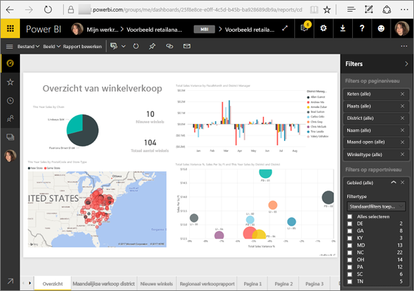

# <a name="filter-a-report-using-query-string-parameters-in-the-url"></a>Een rapport filteren door queryreeksparameters in de URL te gebruiken
Wanneer u een rapport in Power BI-service opent, heeft elke pagina van het rapport een eigen unieke URL. Als u deze rapportpagina wilt filteren, kunt u het deelvenster met filters gebruiken op het rapportcanvas.  Of u kunt queryreeksparameters toevoegen aan de URL om het rapport te filteren. Misschien hebt u een rapport dat u aan collega's wilt laten zien en u wilt het voor hen vooraf filteren. U kunt beginnen met de standaard-URL voor het rapport, de filterparameters toevoegen aan de URL en hen vervolgens via e-mail de volledige URL sturen.



<iframe width="640" height="360" src="https://www.youtube.com/embed/WQFtN8nvM4A?list=PLv2BtOtLblH3YE_Ycas5B1GtcoFfJXavO&amp;showinfo=0" frameborder="0" allowfullscreen></iframe>

## <a name="query-string-parameter-syntax-for-filtering"></a>Syntaxis van queryreeksparameter voor filteren
De syntaxis is vrij eenvoudig: start met de URL van het rapport, voeg een vraagteken toe en vervolgens uw filtersyntaxis.

URL?filter=***Tabel***/***Veld*** eq '***waarde***'


* De naam van de **tabel** en het **veld** zijn hoofdlettergevoelig, de **waarde** is dat niet.
* Velden die verborgen zijn in de rapportageweergave kunnen nog steeds worden gefilterd.
* De **waarde** moet tussen enkele aanhalingstekens staan.
* Het veldtype moet een getal of tekenreeks zijn
* Tabel- en veldnamen mogen geen spaties bevatten.

Als het nog steeds verwarrend voor u is, lees dan verder en we zullen het voor u uitsplitsen.  

## <a name="filter-on-a-field"></a>Filteren op een veld
Stel dat de URL van ons rapport als volgt is.


En we zien op onze visualisatiekaart (boven) dat we winkels in North Carolina hebben.

>[!NOTE]
>Dit voorbeeld is gebaseerd op het [Voorbeeld van een retailanalyse](sample-datasets.md).
> 

Als u het rapport zodanig wilt filteren dat er alleen winkels in North Carolina (NC) worden weergegeven, voegt u het volgende aan de URL toe:

?filter=Winkel/Gebied eq 'NC'


>[!NOTE]
>*NC* is de waarde voor North Carolina zoals opgeslagen in het veld **Gebied** van de tabel **Winkel**.
> 
> 

Nu is het rapport gefilterd op North Carolina. Alle visualisaties op de rapportpagina bevatten alleen gegevens voor North Carolina.


## <a name="filter-on-multiple-fields"></a>Filteren op meerdere velden
U kunt ook filteren op meerdere velden door extra parameters aan uw URL toe te voegen. Daarvoor gaat u terug naar de oorspronkelijke filterparameter.

```
?filter=Store/Territory eq 'NC'
```

Als u wilt filteren op aanvullende velden, voegt u een `and` toe en een ander veld in dezelfde indeling als hierboven. Hier volgt een voorbeeld.

```
?filter=Store/Territory eq 'NC' and Store/Chain eq 'Fashions Direct'
```

<iframe width="640" height="360" src="https://www.youtube.com/embed/0sDGKxOaC8w?showinfo=0" frameborder="0" allowfullscreen></iframe>


### <a name="using-dax-to-filter-on-multiple-values"></a>DAX gebruiken om te filteren op meerdere waarden
U kunt ook op meerdere velden filteren door een berekende kolom te maken waarmee twee velden worden samengevoegd in één waarde. Vervolgens kunt u filteren op die waarde.

We hebben bijvoorbeeld twee velden: gebied en keten. U kunt in Power BI Desktop een [nieuw berekende kolom maken](desktop-tutorial-create-calculated-columns.md) (veld) met de naam GebiedKeten. Houd er rekening mee dat de naam van het **veld** geen spaties mag bevatten. Hier volgt de DAX-formule voor die kolom.

GebiedKeten = [Gebied] & "-" & [Keten]

Publiceer het rapport naar de Power BI-service en gebruik de URL-queryreeks vervolgens om te filteren om zodoende alleen gegevens voor de winkels van Lindseys in NC weer te geven.

    https://app.powerbi.com/groups/me/reports/8d6e300b-696f-498e-b611-41ae03366851/ReportSection3?filter=Store/TerritoryChain eq 'NC–Lindseys'

## <a name="pin-a-tile-from-a-filtered-report"></a>Maak een tegel uit een gefilterd rapport vast
Nadat u het rapport met queryreeksparameters hebt gefilterd, kunt u visualisaties uit het rapport aan uw dashboard vastmaken. De tegel op het dashboard geeft de gefilterde gegevens weer en door het selecteren van deze dashboardtegel opent u het rapport dat is gebruikt om deze te maken.  Het filteren dat u met de URL hebt uitgevoerd, wordt echter niet bij het rapport opgeslagen en wanneer de dashboardtegel wordt geselecteerd, wordt het rapport in ongefilterde toestand geopend.  Dit betekent dat de gegevens die worden weergegeven op de dashboardtegel niet overeenkomen met de gegevens die worden weergegeven in de rapportvisualisatie.

In sommige gevallen kan dit handig zijn wanneer u verschillende resultaten wilt zien; gefilterd op het dashboard en ongefilterd in het rapport.

## <a name="considerations-and-troubleshooting"></a>Aandachtspunten en probleemoplossing
Er zijn een aantal dingen waar u op moet letten bij het gebruik van queryreeksparameters.

* U kunt in Power BI Report Server [rapportparameters doorsturen](https://docs.microsoft.com/sql/reporting-services/pass-a-report-parameter-within-a-url?view=sql-server-2017.md) door ze op te nemen in een rapport-URL. Deze URL-parameters hebben geen voorvoegsel omdat ze rechtstreeks naar de verwerkingsengine rapporteren. 
* Het filteren van een querytekenreeks werkt niet bij URL’s voor [Publiceren naar internet](service-publish-to-web.md) of Power BI Embedded.   
* Het veldtype moet een getal of tekenreeks zijn.
* Tabel- en veldnamen mogen geen spaties bevatten.

## <a name="next-steps"></a>Volgende stappen
[Een visualisatie vastmaken aan een dasboard](service-dashboard-pin-tile-from-report.md)  
[Probeer het uit, het is gratis.](https://powerbi.com/)

Nog vragen? [Misschien dat de Power BI-community het antwoord weet](http://community.powerbi.com/)

