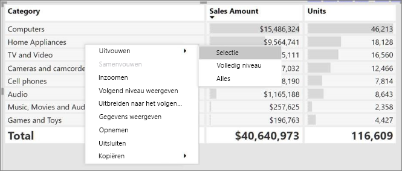
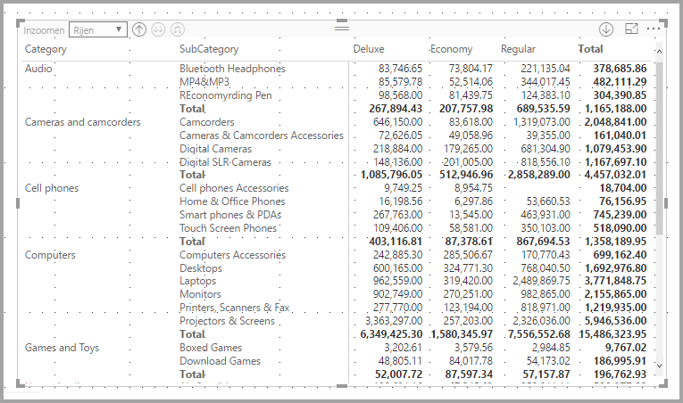
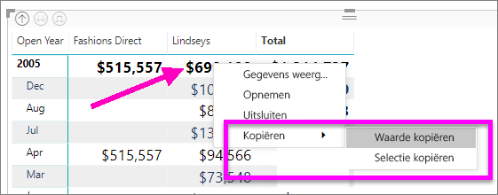
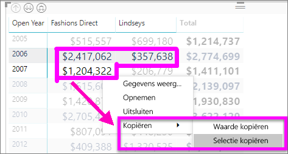

# Matrixvisualisatie in Power BI gebruiken
De **matrix** visual is vergelijkbaar met een **tabel**.  Een tabel 2 dimensies ondersteunt en de gegevens vast is, betekenis dubbele waarden worden weergegeven en niet geaggregeerd. Een matrix kunt u gemakkelijker gegevens over meerdere dimensies nuttige manier worden weergegeven--deze biedt ondersteuning voor een getrapte lay-out. De matrix automatisch combineert de gegevens en kunt inzoomen omlaag. 

Kunt u matrixvisualisaties in **Power BI Desktop** en **Power BI-service** rapporten en elementen kruislings markeren in de matrix met andere visuele elementen op deze pagina van het rapport. Bijvoorbeeld, kunt u selecteren rijen, kolommen en zelfs afzonderlijke cellen en kruislings markeren. Ook kunnen afzonderlijke cellen en meervoudige selectie van de cel worden gekopieerd en geplakt in andere toepassingen. 

Er zijn veel functies gekoppeld aan de matrix, en in de volgende secties van dit artikel gaan we die behandelen.

## Begrijpen hoe Power BI totalen berekent

Voordat u leert hoe u de **Matrix**-visual gebruikt, is het belangrijk om te begrijpen hoe Power BI totale en subtotale waarden in tabellen en matrices berekent. In het geval van totale en subtotale rijen wordt de meting over alle rijen in de onderliggende data geëvalueerd. Het is *geen* eenvoudige optelsom van de waarden in de zichtbare of weergegeven rijen. Dit betekent dat u in de totaalrij andere waarden kunt krijgen dan u had verwacht. 

Bekijk de volgende matrix-visuals. 

In dit voorbeeld wordt elke rij in de matrixvisualisatie geven aan de rechterkant wordt weergegeven de *bedrag* voor elke combinatie van verkoper/datum. Maar omdat een verkoper in meerdere datums verschijnt kunnen de getallen vaker dan één keer worden weergegeven. Het accurate totaal van de onderliggende gegevens en de eenvoudige optelsom van de zichtbare waarden komen daarom niet overeen. Dit is een algemeen patroon wanneer de waarde die u optelt de één is in een één-op-veelrelatie.

Als u naar de totalen en subtotalen kijkt, moet u onthouden dat die waarden zijn gebaseerd op de onderliggende gegevens en niet enkel op de zichtbare waarden. 

<!-- use Nov blog post video

## Expanding and collapsing row headers
There are two ways you can expand row headers. The first is through the right-click menu. You’ll see options to expand the specific row header you clicked on, the entire level or everything down to the very last level of the hierarchy. You have similar options for collapsing row headers as well.

You can also add +/- buttons to the row headers through the formatting pane under the row headers card. By default, the icons will match the formatting of the row header, but you can customize the icons’ color and size separately if you want. 
Once the icons are turned on, they work similarly to the icons from PivotTables in Excel.

The expansion state of the matrix will save with your report. It can be pinned to dashboards as well, but consumers will need to open up the report to change the state. Conditional formatting will only apply to the inner most visible level of the hierarchy. Note that this expand/collapse experience is not currently supported when connecting to AS servers older than 2016 or MD servers.

Watch the following video to learn more about expand/collapse in the matrix:

-->
## Met behulp van inzoomen omlaag met de matrixvisualisatie
Met de matrixvisualisatie, kunt u allerlei interessante Inzoomen op activiteiten die vroeger niet beschikbaar waren doen. Eén hiervan is de mogelijkheid om in te zoomen met behulp van rijen, kolommen en zelfs op afzonderlijke secties en cellen. Laten we eens kijken hoe dat werkt.

### Inzoomen op rijkoppen
Wanneer u in het deelvenster **Visualisaties** meerdere velden toevoeg in de sectie **Rijen** van de **Velden**-put, maakt u het mogelijk in te zoomen op de rijen van de matrixvisualisatie. Dit is vergelijkbaar met het maken van een hiërarchie, die het vervolgens mogelijk maakt in te zoomen op die hiërarchie (en weer terug te gaan) en de gegevens op elk niveau te analyseren.

In de volgende afbeelding, de **rijen** sectie bevat *verkoopfase* en *kansgrootte*, het maken van een groepering (of hiërarchie) in de rijen die we kunnen inzoomen.

Wanneer in de visualisatie een groepering is gemaakt in de sectie **Rijen**, worden in de linkerbovenhoek van de visualisatie zelf de pictogrammen *Inzoomen* en *Uitvouwen* weergegeven.

Net als bij het zoom- en uitvouwgedrag in andere visualisaties, kunnen we met die knoppen inzoomen op (of teruggaan door) de hiërarchie. In dit geval we kunt inzoomen vanuit *verkoopfase* naar *kansgrootte*, zoals wordt weergegeven in de volgende afbeelding, waar het inzoomen op het pictogram voor één niveau (de hooivork) is geselecteerd.

U kunt naast het gebruik van de pictogrammen, selecteert u een van de rijkoppen en inzoomen door te kiezen in het menu dat wordt weergegeven.

Er zijn enkele opties in het menu dat verschijnt die verschillende resultaten genereren:

Selecteren **inzoomen** breidt de matrix voor *die* rijniveau *met uitzondering van* alle andere rijkoppen, behalve de rijkop dat is geselecteerd. In de volgende afbeelding, **voorstel** > **inzoomen** is geselecteerd. U ziet dat andere rijen op het hoogste niveau niet meer in de matrix worden weergegeven. Deze manier van inzoomen is handig, zoals u met name zult zien in de sectie over **kruislings markeren**.

Selecteer de **uitzoomen** pictogram terug te gaan naar de vorige weergave op het hoogste niveau. Als u vervolgens selecteert **voorstel** > **volgend niveau weergeven**, krijgt u een oplopende lijst met alle items in het volgende niveau (in dit geval de *kansgrootte* veld), zonder de hiërarchiecategorisatie op.

Selecteer de **uitzoomen** pictogram in de linkerbovenhoek om de matrix die alle op het hoogste niveau categorieën weergeven, klikt u vervolgens selecteren **voorstel** > **uit te breiden naar het volgende niveau**, naar Zie de waarden voor beide niveaus van de hiërarchie - *verkoopfase* en *kansgrootte*.

U kunt ook de **uit te breiden** menu-item voor het beheren van de weergave verder.  Selecteer bijvoorbeeld **voorstel** > **uit te breiden** > **selectie**. Power BI wordt één rij voor elke *verkoopfase* en alle de *kansgrootte* opties voor *voorstel*.

### Inzoomen op kolomkoppen
Net als bij de mogelijkheid om in te zoomen op rijen, kunt u ook inzoomen op **kolommen**. In de volgende afbeelding, er zijn twee velden in de **kolommen** veld ook, het maken van een hiërarchie die vergelijkbaar is met wat we voor de rijen die u eerder in dit artikel gebruikt. In de **kolommen** veld goed, we hebben *regio* en *Segment*. Als de tweede veld is toegevoegd aan **kolommen**, een nieuwe in het vervolgkeuzemenu weergegeven op het visuele element hier momenteel ziet **rijen**.

Als u wilt inzoomen op kolommen, selecteer **kolommen** uit de *verder kunt bestuderen* menu dat kan worden gevonden in de linkerbovenhoek van de matrix. Selecteer de *Oost* regio en kies **inzoomen**.

Wanneer u selecteert **inzoomen**, het volgende niveau van de kolomhiërarchie voor *regio > Oost* weergegeven, in dit geval *aantal verkoopkansen*. De andere regio wordt weergegeven, maar wordt grijs weergegeven.

De rest van de menu-items werken op kolommen op dezelfde manier als voor rijen (Zie de vorige sectie **Inzoomen op rijkoppen**). U kunt **volgend niveau weergeven** en **uit te breiden naar het volgende niveau** met kolommen die net zoals u met rijen kunt.

> [!NOTE]
> De pictogrammen voor in- en uitzoomen linksboven in de matrixvisual zijn alleen van toepassing op rijen. Als u wilt inzoomen op kolommen, moet u het contextmenu gebruiken.
> 
> 

## Getrapte indeling met matrixvisualisatie
In de visual **Matrix** worden de subcategorieën automatisch ingesprongen in een hiërarchie onder elk bovenliggend item; dit wordt een **indeling met interval** genoemd.

In de *oorspronkelijke* versie van de matrixvisualisatie werden subcategorieën weergegeven in een geheel andere kolom, wat veel meer ruimte kostte in de visualisatie. In de volgende afbeelding wordt de tabel in de oorspronkelijke visual **Matrix** weergegeven; u ziet dat de subcategorieën in een afzonderlijke kolom staan.

In de volgende afbeelding ziet u de visual **Matrix** met een **indeling met interval** in actie. U ziet dat de categorie *Computers* subcategorieën heeft (Computeraccessoires, Desktops, Laptops, Monitors, enzovoort) die enigszins zijn ingesprongen, waardoor de visualisatie er netter en veel compacter uitziet.

U kunt de instellingen van de indeling met interval gemakkelijk aanpassen. Selecteer de **Matrix**-visualisatie en vouw in de sectie **Opmaak** (verfrollerpictogram) van het deelvenster **Visualisaties** de sectie **Rijkoppen** uit. U hebt twee opties: de wisselknop **Getrapte lay-out** (waarmee u dit in- of uitschakelt) en de **Inspringing voor getrapte lay-out** (hiermee geeft u het aantal ingesprongen pixels op).

Als u **Getrapte lay-out** uitschakelt, worden de subcategorieën weergegeven in een aparte kolom in plaats van ingesprongen onder de bovenliggende categorie.

## Subtotalen met matrixvisualisaties
U kunt subtotalen in- of uitschakelen in matrixvisualisaties, zowel voor rijen als kolommen. In de volgende afbeelding ziet u dat de rijsubtotalen zijn ingesteld op **aan**.

Vouw in de sectie **Opmaak** van het deelvenster **Visualisaties** de kaart **Subtotalen** uit en zet de schuifknop **Rijsubtotalen** op **Uit**. Wanneer u dit doet, worden de subtotalen niet weergegeven.

Hetzelfde geldt voor de kolomsubtotalen.

## Kruislings markeren met matrixvisualisaties
Met de visual **Matrix** kan elk element in de matrix worden geselecteerd als de basis voor kruislings markeren. Selecteer een kolom in een **Matrix**, en die kolom wordt gemarkeerd, net als andere visualisaties op de rapportpagina. Dit type kruislings markeren was al een algemene functie van andere visualisaties en gegevenspuntselecties, en nu biedt de **matrix**visualisatie dezelfde functionaliteit.

Bovendien werkt Ctrl+klikken ook voor kruislings markeren. In de volgende afbeelding is bijvoorbeeld een verzameling subcategorieën geselecteerd in de **Matrix**visualisatie. U ziet dat items die niet in de visualisatie zijn geselecteerd, lichter zijn gekleurd, en dat de in de **Matrix**-visualisatie gemaakte selecties worden weerspiegeld in de andere visualisaties op de pagina.

## Waarden kopiëren uit Power BI voor gebruik in andere toepassingen

Uw matrix of tabel bevat mogelijk inhoud die u wilt gebruiken in andere toepassingen, bijvoorbeeld Dynamics CRM, Excel of zelfs andere Power BI-rapporten. Met een rechtermuisklik in Power BI kopieert en plakt u een afzonderlijke cel of een selectie cellen naar uw klembord in de andere toepassing.

* Kopieer de waarde van een enkele cel, selecteer de cel, klik er met de rechtermuisknop op en kies **Waarde kopiëren**. Als u de onopgemaakte celwaarde naar uw klembord hebt gekopieerd, kunt u deze nu kopiëren in een andere toepassing.

    

* Als u meer dan een enkele cel wilt kopiëren, selecteert u een reeks cellen, of gebruikt u CTRL om één of meer cellen te selecteren. De kolomkoppen en rijkoppen zijn opgenomen in de kopie.

    

## Arcering en tekstkleuren met matrixvisualisaties
Met de matrixvisualisatie, kunt u toepassen **voorwaardelijke opmaak** (kleuren en arcering en de gegevens) op de achtergrond van cellen in de matrix, en u kunt voorwaardelijke opmaak toepassen op de tekst en waarden zelf.

Voorwaardelijke opmaak wilt toepassen, selecteert u de matrix visual en open de **indeling** deelvenster. Vouw de **voorwaardelijke opmaak** kaart en voor **achtergrondkleur**, **tekstkleur**, of **gegevensbalken**, zet de schuifknop aan **Op**. Een koppeling voor het inschakelen van een van deze opties weergegeven *geavanceerde besturingselementen*, waar u kunt u aanpassen de kleuren en waarden voor de opmaak.
  
  

Selecteer *geavanceerde besturingselementen* om een dialoogvenster waarin u aanpassingen kunt weer te geven. In dit voorbeeld ziet u het dialoogvenster voor **gegevensbalken**.

## Volgende stappen

[Spreidingsdiagrammen en bellendiagrammen in Power BI](power-bi-visualization-scatter.md)

[Visualization types in Power BI](power-bi-visualization-types-for-reports-and-q-and-a.md) (Typen visualisaties in Power BI)