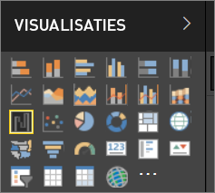

# Visualisaties in Power BI-rapporten

Visualisaties (ook wel visuals genoemd) geven inzichten weer die zijn gedetecteerd in de gegevens. Een Power BI-rapport beschikt mogelijk over één pagina met één visual of over pagina’s vol met visuals. In Power BI-service kunnen visuals [vanuit rapporten aan dashboards worden vastgemaakt](../service-dashboard-pin-tile-from-report.md).

Het is belangrijk om te maken van het onderscheid tussen rapport *ontwerpers* en het rapport *consumenten* als u de persoon die het bouwen of wijzigen van het rapport zijn, dan u een ontwerper bent.  Ontwikkelaars hebben bewerkmachtigingen voor het rapport en de onderliggende gegevensset. In Power BI Desktop betekent dit dat u de gegevensset kunt openen in de gegevensweergave en visuals in de rapportweergave kunt maken. In Power BI-service betekent dit dat u kunt de gegevensset of rapport openen in de rapporteditor in [Bewerkweergave](../consumer/end-user-reading-view.md). Wanneer een rapport of dashboard met u [gedeeld is ](../consumer/end-user-shared-with-me.md), bent u een **rapportgebruiker**. U zult kunnen zien en gebruiken met het rapport en de visuele elementen, maar niet mogelijk belangrijke wijzigingen op te slaan.

Er zijn veel verschillende typen visuals rechtstreeks beschikbaar vanuit het deelvenster VISUALISATIES in Power BI.

Ga voor nog meer opties naar de [communitysite van Microsoft AppSource](https://appsource.microsoft.com) waar u [aangepaste visuals](../developer/custom-visual-develop-tutorial.md) van Microsoft en de community kunt vinden en [downloaden](https://appsource.microsoft.com/marketplace/apps?page=1&product=power-bi-visuals).

<iframe width="560" height="315" src="https://www.youtube.com/embed/SYk_gWrtKvM?list=PL1N57mwBHtN0JFoKSR0n-tBkUJHeMP2cP" frameborder="0" allowfullscreen></iframe>

  Als u geen ervaring hebt met Power BI, of een opfriscursus nodig hebt, volgt u de onderstaande koppelingen voor meer informatie over de basisprincipes van Power BI-visualisaties.  U kunt ook de inhoudsopgave (aan de linkerkant van dit artikel) gebruiken om nog meer nuttige informatie te vinden.

## Een visualisatie toevoegen in Power BI

U [maakt visualisaties](power-bi-report-add-visualizations-i.md) op de pagina's van uw rapporten. Blader door de [lijst met beschikbare visualisaties en de beschikbare zelfstudies voor visualisaties.](power-bi-visualization-types-for-reports-and-q-and-a.md) 

## Een aangepaste visualisatie uploaden en deze gebruiken in Power BI

U kunt zelfgemaakte, aangepaste visualisaties toevoegen of visualisaties die u hebt gevonden op de [communitysite van Microsoft AppSource](https://appsource.microsoft.com/marketplace/apps?product=power-bi-visuals). Bent u in een creatieve bui? Bestudeer onze broncode en gebruik onze [hulpprogramma's voor ontwikkelaars](../developer/custom-visual-develop-tutorial.md) om een nieuw type visualisatie te maken en dit vervolgens te [delen met de community](../developer/office-store.md). Raadpleeg [Een aangepaste Power BI-visual ontwikkelen](../developer/custom-visual-develop-tutorial.md) voor meer informatie over een aangepaste visual ontwikkelen.

## Het type visualisatie wijzigen

Probeer [het type visualisatie te wijzigen](power-bi-report-change-visualization-type.md) om te kijken of dat misschien beter geschikt is voor uw gegevens.

## Visualisatie vastmaken

Als de visualisatie helemaal aan uw wensen voldoet, kunt u deze in Power BI-service als een tegel [aan een dashboard vastmaken](../service-dashboard-pin-tile-from-report.md). Als u de visualisatie die wordt gebruikt in het rapport wijzigt nadat u deze hebt vastgemaakt, verandert de tegel op het dashboard niet; als het een lijndiagram was, blijft het een lijndiagram, zelfs wanneer u het hebt gewijzigd in een ringdiagram in het rapport.

## Beperkingen en overwegingen
- Afhankelijk van de gegevensbron en het aantal velden (metingen of kolommen), kan een visueel element langzaam geladen.  Het is raadzaam om visuele elementen op de totale velden 10-20, zowel voor de leesbaarheid en prestaties te beperken. 

- De bovenste limiet voor visuele elementen is 100 velden (metingen of kolommen). Als uw visuele element niet laden Verminder het aantal velden.   

## Volgende stappen

* [Visualization types in Power BI](power-bi-visualization-types-for-reports-and-q-and-a.md) (Typen visualisaties in Power BI)
* [Aangepaste visuals](../power-bi-custom-visuals.md)