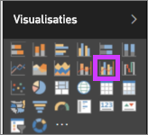
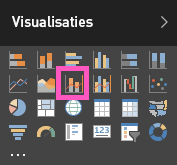

# Combinatiegrafieken in Power BI

Een combinatiegrafiek in Power BI is een visualisatie waarin een lijndiagram wordt gecombineerd met een kolomdiagram. Als u deze twee diagrammen combineert, kunt u de gegevens sneller vergelijken.

Combinatiegrafieken kunnen één of twee Y-assen bevatten.

## Wanneer gebruikt u een combinatiegrafiek?

In de volgende gevallen komen combinatiegrafieken goed van pas:

* Als u hebt een lijndiagram en een kolomdiagram met dezelfde X-as hebt.

* Als u meerdere metingen met verschillende waardebereiken wilt vergelijken.

* Als u het verband tussen twee metingen wilt illustreren in één visualisatie.

* Als u wilt controleren of één meting voldoet aan het doel dat is gedefinieerd in een andere meting.

* Als u ruimte op het canvas wilt besparen.

## Vereisten

Combinatiegrafieken zijn beschikbaar in de Power BI-service en Power BI Desktop. Deze zelfstudie maakt gebruik van de Power BI-service om een combinatiegrafiek te maken. Zorg ervoor dat u beschikt over referenties om u aan te melden bij Power BI.

Kijk hoe Will een combinatiegrafiek maakt op basis van het voorbeeld van verkoop en marketing.

<iframe width="560" height="315" src="https://www.youtube.com/embed/lnv66cTZ5ho?list=PL1N57mwBHtN0JFoKSR0n-tBkUJHeMP2cP" frameborder="0" allowfullscreen></iframe>  

## Een eenvoudige combinatiegrafiek met één as maken

Als u deze wilt volgen, opent u de Power BI-service en maakt u verbinding met het **Voorbeeld van een retailanalyse**. Als u zelf een combinatiegrafiek wilt maken, meldt u zich aan bij de Power BI-service, en selecteert u **Gegevens ophalen** > **Voorbeelden** > **Voorbeeld van retailanalyse** > **Verbinden**. Het dashboard **Voorbeeld van een retailanalyse** wordt weergegeven.

1. Selecteer op het dashboard Voorbeeld van een retailanalyse de tegel **Totaal aantal winkels** om het rapport **Verkoopoverzicht van winkels** te openen.

1. Selecteer **Rapport bewerken** om het rapport in de bewerkingsweergave te openen.

1. Selecteer onder aan de pagina **+** om een nieuwe rapportpagina toe te voegen.

1. Maak een kolomdiagram waarin de omzet voor dit jaar en de brutomarge marge per maand worden weergegeven.

    1. Selecteer in het deelvenster Velden achtereenvolgens **Verkoop** \> **Omzet dit jaar** > **Waarde**.

    1. Sleep **Verkoop** \> **Brutomarge dit jaar** naar de bron **Waarde**.

    1. Selecteer **Tijd** \> **FiscalMonth** om deze waarde toe te voegen aan de bron **As**.

        

1. Selecteer het beletselteken in de rechterbovenhoek van de visualisatie en selecteer **Sorteren op > FiscalMonth**. Als u de sorteervolgorde wilt wijzigen, selecteert u het beletselteken opnieuw en kiest u **Oplopend sorteren** of **Aflopend sorteren**.

1. Converteer de kolomdiagram naar een combinatiegrafiek. Er zijn twee combinatiegrafieken beschikbaar: **Lijndiagram en gestapelde kolomdiagram** en **Lijndiagram en gegroepeerde kolomdiagram**. Selecteer de kolomdiagram en selecteer vervolgens in het deelvenster **Visualisaties** de optie **Lijndiagram en gegroepeerd kolomdiagram**.

    

1. Ga naar het deelvenster **Velden** en sleep **Verkoop** > **Omzet van afgelopen jaar** naar de bron **Regelwaarden**.

    

    Uw combinatiegrafiek moet er ongeveer als volgt uitzien:

    

## Een combinatiegrafiek met twee assen maken

In deze taak vergelijken we de brutomarge en de omzet.

1. Maak een nieuw lijndiagram waarin de **procentuele brutomarge van het vorige jaar** per **maand wordt bijgehouden**. Selecteer het beletselteken om te sorteren per **Maand** en **Oplopend**.

    

     In januari was de brutomarge 35%, in april nemen we een piek (45%) waar, in juli daalde het brutomargepercentage en in augustus was er opnieuw een daling. Krijgen we een soortgelijk patroon voor afgelopen jaar en dit jaar te zien?

1. Voeg **Omzet van dit jaar** > **Waarde** en **Omzet van afgelopen jaar** toe aan het lijndiagram. De schaal van de **Procentuele brutomarge van het vorige jaar** is veel kleiner dan de schaal van **Verkoop**. Hierdoor is het lastig om de waarden te vergelijken.

    

1. Converteer het lijndiagram naar een Lijndiagram en gestapeld kolomdiagram, zodat de visualisatie eenvoudiger te lezen en te interpreteren is.

    

1. Sleep **Brutomarge% vorig jaar** van **Kolomwaarden** naar **Lijnwaarden**. 

    

    In Power BI worden twee assen gemaakt, worden de gegevenssets met de service verschillend kunnen worden geschaald. Aan de linkerkant wordt de verkoop gemeten in dollars, en aan de rechterkant in percentages. Ook krijgen we een antwoord op onze vraag: Ja, we zien een vergelijkbaar patroon.

## Titels toevoegen aan de assen

1. Selecteer het pictogram met verfroller  om het Opmaakvenster te openen.

1. Selecteer de pijl-omlaag om de **Y-as** uit te breiden.

1. Selecteer voor **Y-as (kolom)** deze opties:

    | Instelling | Waarde |
    | ------- | ----- |
    | Positie | Selecteer **Links**. |
    | Eenheden weergeven | Selecteer **Miljoenen**. |
    | Titel | Beweeg de schuifregelaar naar **Aan**. |
    | Stijl | Selecteer **Alleen titel weergeven**. |
    | Secundaire weergeven | Beweeg de schuifregelaar naar **Aan**.  Hiermee geeft u de opties weer om het regeldiagramgedeelte van de combinatiegrafiek op te maken. |

1. Selecteer voor **X-as (regel)** deze opties:

    | Instelling | Waarde |
    | ------- | ----- |
    | Positie | Selecteer **Rechts**. |
    | Titel | Beweeg de schuifregelaar naar **Aan**. |
    | Stijl | Selecteer **Alleen titel weergeven**. |

    In uw combinatiegrafiek worden nu twee assen weergegeven, beide met titels.

    

1. Wijzig desgewenst het lettertype, de grootte en de kleur, en stel de overige opmaakopties zo in dat de weergave en leesbaarheid van de grafiek worden verbeterd.

U kunt nu het volgende doen:

* [De combinatiegrafiek toevoegen als dashboardtegel](../service-dashboard-tiles.md).

* [Sla het rapport op](../service-report-save.md).

* [Het rapport toegankelijker maken voor mensen met beperkingen](../desktop-accessibility.md).

## Kruislings markeren en kruislings filteren

Wanneer u een kolom of regel in een combinatiegrafiek markeert, worden de andere visualisaties op de rapportpagina kruislings gemarkeerd en gefilterd. U kunt deze standaardwerking wijzigen met behulp van het besturingselement [Visuele interactie](../service-reports-visual-interactions.md).

## Volgende stappen

[Ringdiagrammen in Power BI](power-bi-visualization-doughnut-charts.md)

[Visualization types in Power BI](power-bi-visualization-types-for-reports-and-q-and-a.md) (Typen visualisaties in Power BI)