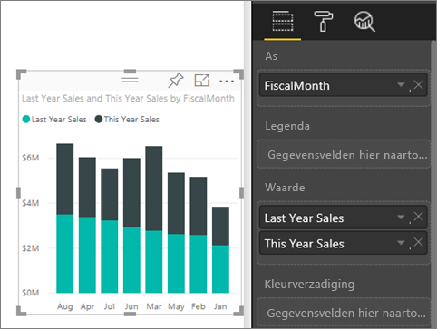
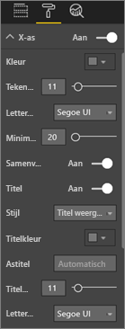
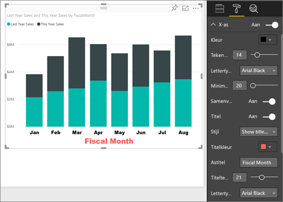
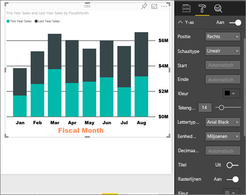
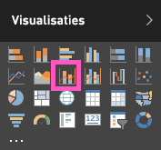
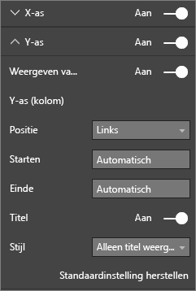

# Eigenschappen van X-as en Y-as aanpassen

In deze zelfstudie leert u veel verschillende manieren om de X-as en Y-as van uw visualisaties aan te passen. Niet alle visualisaties hebben assen. Cirkeldiagrammen hebben bijvoorbeeld geen assen. Daarnaast verschillen de aanpassingsopties per visualisatie. Aangezien de mogelijkheden te groot zijn om in één artikel te behandelen, bekijken we een aantal van de meestgebruikte as-aanpassingen en maken we u vertrouwd met het tabblad **Indeling** voor de opmaak van visualisaties in het rapportcanvas van Power BI.  

> [!NOTE]
> Deze pagina is van toepassing op zowel de Power BI-service als Power BI Desktop. Deze aanpassingen komen beschikbaar wanneer u het pictogram **Indeling** (de verfroller ) selecteert en zijn ook beschikbaar in Power BI Desktop.

Kijk hoe Amanda de X- en Y-assen aanpast. Ze laat zien hoe u op verschillende manieren de samenvoeging kunt regelen wanneer u gaat inzoomen of uitzoomen.

<iframe width="560" height="315" src="https://www.youtube.com/embed/9DeAKM4SNJM" frameborder="0" allowfullscreen></iframe>

## Vereisten

- De Power BI service

- Het rapport Voorbeeld van een retailanalyse

## X- en Y-assen van visualisaties aanpassen in rapporten

Als u mee wilt doen, meld u zich aan bij de [Power BI-service](https://app.powerbi.com) en opent u het rapport [Voorbeeld van een retailanalyse](../sample-datasets.md) in de weergave [Rapport bewerken](../service-interact-with-a-report-in-editing-view.md).

### Een visualisatie met een gestapeld kolomdiagram maken

Voordat u een visualisatie kunt aanpassen, zult u deze moeten bouwen.

1. Vouw in de Power BI-service **Mijn werkruimte** uit.

1. Scrol omlaag en selecteer **Retail Analysis Sample** in de lijst **Gegevenssets**.

1. Selecteer in het deelvenster **Visualisaties** het pictogram Gestapeld kolomdiagram.

    

1. Als u de waarden voor de X-as wilt instellen, selecteert u **Time** > **FiscalMonth** in het deelvenster **Velden**.

1. Als u de waarden voor de Y-as wilt instellen, selecteert u **Sales** > **Last Year Sales** en **Sales** > **This Year Sales** > **Value** in het deelvenster **Fields**.

    

### De X-as aanpassen

Nu kunt u de X-as gaan aanpassen.

1. Selecteer in het deelvenster **Visualisaties** het pictogram **Indeling** (het pictogram van een verfroller ) om de aanpassingsopties weer te geven.

1. Vouw de X-as-opties uit.

   

1. Verplaats de schuifregelaar **X-as** naar **Aan**.

    

    Een reden waarom u mogelijk de X-as zou willen uitschakelen, is om ruimte te maken voor meer gegevens.

1. Maak de kleur, de grootte en het lettertype van de tekst op:

    - **Kleur**: selecteer zwart

    - **Tekengrootte**: voer *14* in

    - **Lettertypefamilie**: selecteer **Arial Black**

1. Zet de schuifregelaar **Titel** op **Aan** om de naam van de X-as weer te geven. In dit geval is dat **FiscalMonth**.

1. Maak de kleur, de grootte en het lettertype van de titeltekst op:

    - **Titelkleur**: selecteer oranje

    - **Astitel**: voer *Fiscal Month* in

    - **Tekengrootte titel**: voer *21* in

Als u klaar bent met de aanpassingen, ziet het gestapelde kolomdiagram er ongeveer zo uit:

Sla de wijzigingen op die u hebt aangebracht en ga naar de volgende sectie.

Als u om wat voor reden dan ook alle wijzigingen omgedaan wilt maken, selecteert u **Standaardinstelling herstellen** onderaan het aanpassingsvenster **X-as**.

### De Y-as aanpassen

Vervolgens gaat u de Y-as aanpassen.

1. Vouw de Y-as-opties uit.

   

1. Zet de schuifregelaar **Y-as** op **Aan**.  

    

    Een reden waarom u mogelijk de Y-as zou willen uitschakelen, is om ruimte te maken voor meer gegevens.

1. Selecteer voor **Positie** de optie **Rechts**.

1. Maak de kleur, de grootte en het lettertype van de tekst op:

    - **Kleur**: selecteer zwart

    - **Tekengrootte**: voer *14* in

    - **Lettertypefamilie**: selecteer **Arial Black**

1. Stel **Weergave-eenheden** in op **Miljoenen** en **Decimaalposities voor de waarden** op *0*.

1. Deze visualisatie wordt er niet beter op als we een titel gebruiken voor de Y-as, dus laten we **Titel** op **Uit** staan.  

1. We laten de rasterlijnen opvallen door de kleur te wijzigen en de streek dikker te maken:

    - **Kleur**: selecteer donkergrijs

    - **Streekdikte**: voer *2* in

Na al deze aanpassingen zou uw kolomdiagram er ongeveer als volgt moeten uitzien:

## Visualisaties met twee Y-assen aanpassen

Eerst maakt u een combinatiegrafiek waarmee u de impact kunt bekijken die het aantal winkels heeft op de verkoop. Dit is dezelfde grafiek die we hebben gemaakt in de [zelfstudie over combinatiegrafieken](power-bi-visualization-combo-chart.md). Vervolgens gaat u de twee Y-assen opmaken.

### Een grafiek met twee Y-assen maken

1. Maak een nieuw lijndiagram waarin de **Sales (Verkoop) > Gross Margin last year % (Brutomarge% vorig jaar)** per **Time (Tijd) > FiscalMonth (Boekmaand)** wordt bijgehouden.

    

    > [!NOTE]
    > Zie [Sorteren op andere criteria](../consumer/end-user-change-sort.md#other) voor hulp bij het sorteren op maand.

    In januari bedroeg de brutomarge 35%, met daarna een piek van 45% in april, een lichte terugval in juli en opnieuw een piek in augustus. Krijgen we een soortgelijk patroon voor afgelopen jaar en dit jaar te zien?

1. Voeg **Omzet van dit jaar > Waarde** en **Omzet van afgelopen jaar** aan het lijndiagram toe.

    

    De schaal van **Gross Margin Last Year %** (de blauwe lijn die langs de rasterlijn **0M%** loopt) is veel kleiner dan de schaal van **Sales**, waardoor het lastig is om een vergelijking te maken. Een de percentages in de labels op de Y-as zijn absurd.

1. U kunt de visualisatie makkelijker te lezen en te interpreteren maken door het lijndiagram te converteren naar een lijndiagram met een gestapeld kolomdiagram.

   

1. Sleep **Brutomarge% vorig jaar** van **Kolomwaarden** naar **Lijnwaarden**.

    

    U hebt nu het gestapelde kolomdiagram dat u in de eerste sectie hebt gemaakt, met een lijndiagram dat eroverheen is gelegd. Gebruik eventueel wat u hierboven hebt geleerd om de kleur en tekengrootte van de assen op te maken.

   

   Power BI maakt twee assen, waardoor de schaal van de gegevenssets afzonderlijk van elkaar kan worden ingesteld. Op de linkeras wordt de verkoop aangegeven in dollars en op de rechteras in percentages.

### De secundaire Y-as opmaken

1. Selecteer het verfrollerpictogram in het deelvenster **Visualisaties** om de opmaakopties weer te geven.

1. Vouw de Y-as-opties uit.

1. Scrol omlaag totdat u de optie **Secundaire weergeven** ziet. Controleer of deze op **Aan** staat.

   

1. (Optioneel) Pas de twee assen aan. Als u de **Positie** voor de kolomas of de lijnas verwisselt, wisselen de twee assen van kant.

### Voeg titels toe aan beide assen

In het geval van een visualisatie die zo ingewikkeld is, kan het zinvol zijn om astitels toe te voegen.  Titels helpen uw collega's om het verhaal te begrijpen dat u met uw visualisatie wilt vertellen.

1. Zet de **Titel** op **Aan** voor **Y-as (kolom)** en de **Y-as (rij)** .

1. Stel **Stijl** in op **Alleen titel weergeven** voor beide assen.

   

1. In uw combinatiegrafiek worden nu twee assen weergegeven, beide met titels.

   

Zie [Tips en trucs voor het gebruik van kleuren in Power BI](service-tips-and-tricks-for-color-formatting.md) voor meer informatie.

## Aandachtspunten en probleemoplossing

Als de X-as door de eigenaar van het rapport wordt gecategoriseerd als een gegevenstype, wordt de optie **Type** weergegeven en kunt u kiezen tussen doorlopend of categorisch.

## Volgende stappen

- [Visualisaties in Power BI-rapporten](power-bi-report-visualizations.md)

- [Titels, legenda's en achtergronden van visualisaties aanpassen](power-bi-visualization-customize-title-background-and-legend.md)

- [Aan de slag met de kleuropmaak en de eigenschappen van assen](service-getting-started-with-color-formatting-and-axis-properties.md)

- [Basisconcepten voor gebruikers van de Power BI-service](../consumer/end-user-basic-concepts.md)

Hebt u nog vragen? [Misschien dat de Power BI-community het antwoord weet](http://community.powerbi.com/)
