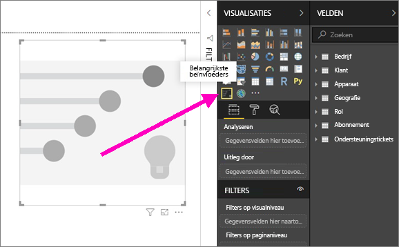
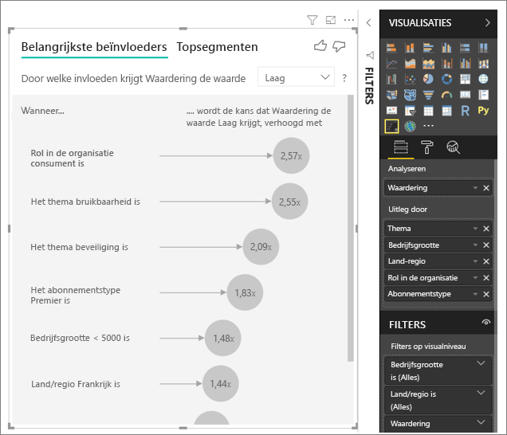
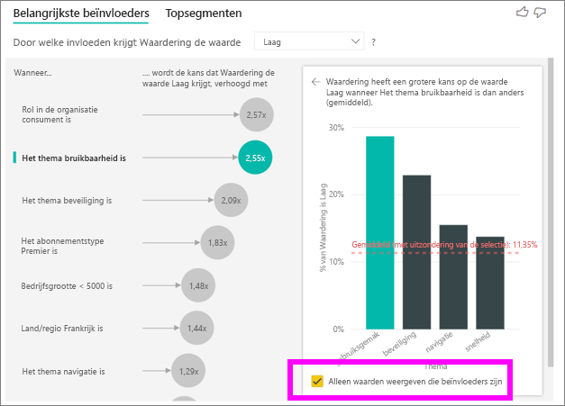
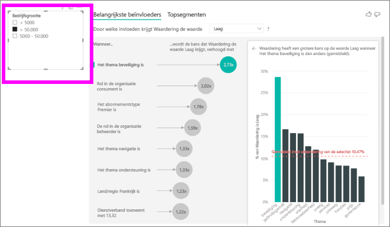
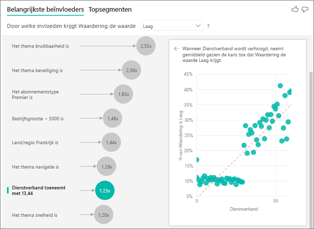
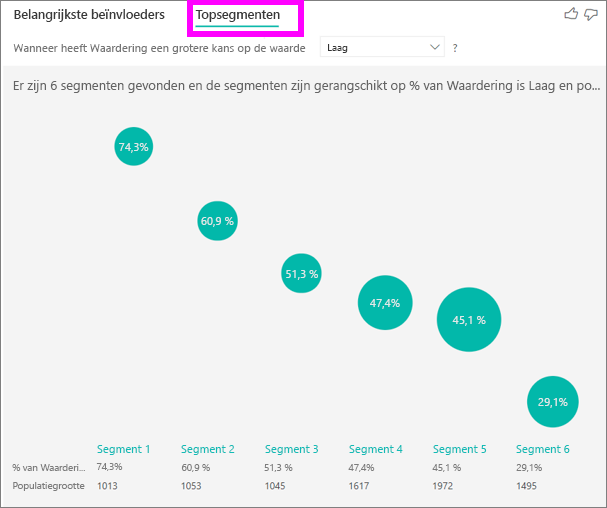
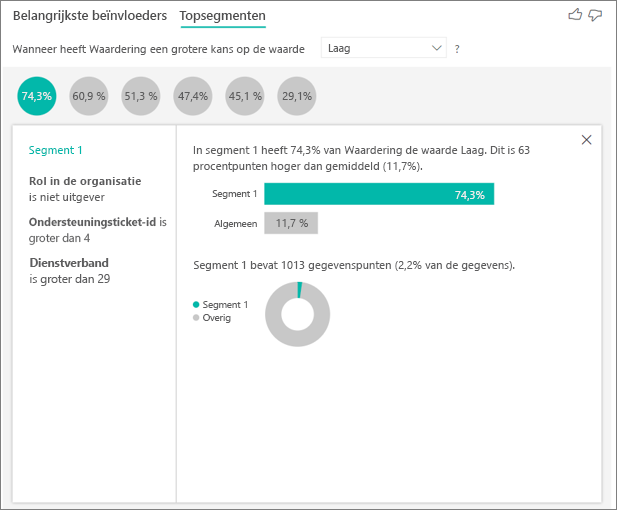
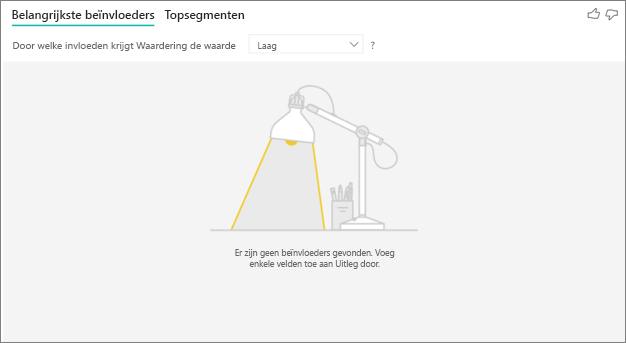
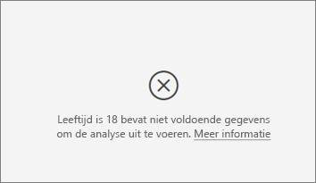
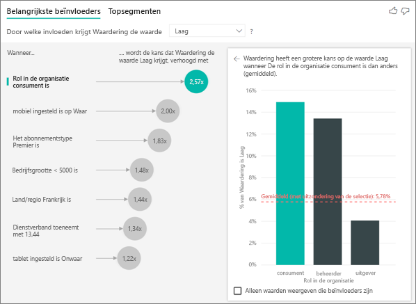

# Visualisatie Belangrijkste beïnvloeders
De beoordelaars visual kunt u de factoren begrijpen dat station een metrische waarde u geïnteresseerd bent in. Uw gegevens worden geanalyseerd en de factoren die van belang zijn worden gerangschikt en als belangrijkste beïnvloeders weergegeven. Stel bijvoorbeeld dat u wilt achterhalen welke invloed de omzet van werknemer, dit is ook wel bekend als verloop. Één van meerdere factoren mogelijk werkgelegenheid contract lengte en een andere factor mogelijk leeftijd werknemer. 
 
## Wanneer u de beoordelaars 
De beoordelaars visuele element is een goede keuze als u wilt: 
- Zie welke factoren van invloed zijn op de metrische gegevens die wordt geanalyseerd.
- Het relatieve belang van deze factoren contrast. Hebben kortlopende arbeidscontracten bijvoorbeeld meer invloed op het verloop dan langlopende contracten? 

## Vereisten voor Belangrijkste beïnvloeders 
De metrische gegevens die u analyseert moet numerieke of categorische veld (statistische functies en metingen zijn nog niet ondersteund).

## Functies van de visual beoordelaars

1. **Tabbladen**: Selecteer een tabblad om over te schakelen tussen weergaven. **Testteam sleutel** ziet u de belangrijkste bijdragers aan de geselecteerde metrische waarde. **Belangrijkste segmenten** ziet u de belangrijkste segmenten die aan de geselecteerde metrische waarde bijdragen. Een *segment* bestaat uit een combinatie van waarden. Bijvoorbeeld, mogelijk één segment consumenten die klanten zijn geweest gedurende ten minste 20 jaar en bevinden zich in de regio west. 

2. **Vervolgkeuzelijst**: De waarde van de metrische gegevens onder onderzoek. In dit voorbeeld kijken de metriek **waardering**. De geselecteerde waarde wordt **laag**.

3. **Aanpassing**: Hiermee kunt u het visuele element in het linkerdeelvenster worden geïnterpreteerd.

4. **Linkerdeelvenster**: In het linkerdeelvenster bevat één visueel element. In dit geval ziet in het linkerdeelvenster u een lijst van de bovenste beoordelaars.

5. **Aanpassing**: Hiermee kunt u het visuele element in het rechter deelvenster interpreteren.

6. **Rechterdeelvenster**: In het rechterdeelvenster bevat één visueel element. In dit geval alle waarden in het kolomdiagram worden weergegeven voor de sleutel besluitvormer **thema** die is geselecteerd in het linkerdeelvenster. De waarde van **bruikbaarheid** in het linkerdeelvenster wordt weergegeven in het groen. Alle andere waarden voor **thema** in zwart-wit worden weergegeven.

7. **Lijn voor gemiddelde**: Het gemiddelde wordt berekend voor alle andere mogelijke waarden voor **thema** behalve **bruikbaarheid**. De berekening is dus van toepassing op alle zwarte waarden. Het vertelt u welk percentage van de andere **thema's** heeft u een lage waardering. Met andere woorden, wanneer een beoordeling is opgegeven door een klant, beschrijft die klant ook de reden of thema voor de classificatie. Sommige thema's zijn bruikbaarheid, de snelheid en beveiliging. 

   **Thema is bruikbaarheid** is de tweede hoogste sleutel besluitvormer voor een lage waardering, op basis van het visuele element in het linkerdeelvenster. Als u alle andere thema's en hun bijdrage aan een classificatie van gemiddelde **laag**, krijgt u het resultaat in rood weergegeven. Van alle andere thema's gegeven, alleen 11.35% hoger zijn dan **bruikbaarheid**.

8. **Selectievakje**: **Alleen waarden die testteam zijn weergeven**.

## Een visual Belangrijkste beïnvloeders maken 
 
Bekijk deze video voor meer informatie over het maken van een beoordelaars visual. Volg deze stappen voor het maken van een. 

<iframe width="560" height="315" src="https://www.youtube.com/embed/fDb5zZ3xmxU" frameborder="0" allow="accelerometer; autoplay; encrypted-media; gyroscope; picture-in-picture" allowfullscreen></iframe>

Uw Product Manager wil dat u om te achterhalen welke rekening wordt gehouden met potentiële klanten als u wilt laten negatieve beoordelingen over uw cloudservice. Open het [PBIX-bestand Klantenfeedback](https://github.com/Microsoft/powerbi-desktop-samples/blob/master/2019/customerfeedback.pbix) in Power BI Desktop om het voorbeeld verder te volgen. U kunt ook downloaden de [klant Feedback Excel-bestand voor Power BI-service of Power BI Desktop](https://github.com/Microsoft/powerbi-desktop-samples/blob/master/2019/customerfeedback.xlsx). 

> [!NOTE]
> De gegevensset van Feedback van klanten is gebaseerd op [Moro markt, 2014] S. Moro, P. Cortez en P. Rita. "Een gegevensgestuurde methode om te voorspellen van het succes van de Bank Telemarketing." *Ondersteuning voor systemen besluit*, Elsevier, 62:22-31 invoert, juni 2014. 

1. Open het rapport en selecteer de **sleutel testteam** pictogram. 

    

2. Verplaatsen van de metrische gegevens die u onderzoeken wilt in de **analyseren** veld. De **analyseren** veld ondersteunt alleen categorische of niet-doorlopende, variabelen. Om te zien wat een klant stations classificatie van de service laag, selecteer **klantentabel** > **classificatie**. 
3. Velden verplaatsen waarvan u denkt dat deze mogelijk van invloed op **waardering** in de **uitgelegd door** veld. U kunt zo veel velden als u wilt verplaatsen. In dit geval kunt u beginnen met:
    - Land-regio 
    - Rol in organisatie 
    - Abonnementstype 
    - Bedrijfsgrootte 
    - Thema 
1. Als u wilt zich richten op de negatieve classificaties, selecteer **laag** in de **wat van invloed op de classificatie moet** vervolgkeuzelijst.  

    

De analyse wordt uitgevoerd op het tabelniveau van het veld dat wordt geanalyseerd. In dit geval heeft de **waardering** metrische gegevens. Met deze metriek wordt gedefinieerd op het klantenniveau van een. Elke klant heeft een hoge score of een lage score gegeven. De verklarende factoren moeten worden gedefinieerd op het klantenniveau van de voor het visuele element te gebruiken. 

In het vorige voorbeeld hebben alle verklarende factoren een één of een veel-op-een-relatie met de metrische gegevens. In dit geval heeft elke score precies één thema dat is gekoppeld aan deze. Dit thema is het belangrijkste thema van de beoordeling van de klant. Klanten zijn op dezelfde manier, afkomstig van één land/regio, één lidmaatschapstype hebben, en één rol uitvoeren in hun organisatie. De verklarende factoren zijn al de kenmerken van een klant is en geen transformaties nodig zijn. Het visuele element kunt onmiddellijk gebruik hiervan maken. 

Later in de zelfstudie hebt u complexere voorbeelden bekijken waarvoor een-op-veel-relaties. In deze gevallen moeten de kolommen eerst worden geaggregeerd op het klantenniveau voordat u de analyse kunt uitvoeren. 

Metingen en samentellingen gebruikt als verklarende factoren ook worden geëvalueerd op het tabelniveau van de van de **analyseren** metrische gegevens. Enkele voorbeelden worden verderop in dit artikel weergegeven. 

## Categorische beoordelaars interpreteren 
Laten we eens de beoordelaars voor lage classificaties. 

### Bovenste één factor die het koopgedrag de kans op een lage waardering beïnvloedt

De organisatie in dit voorbeeld heeft drie rollen: consumenten, beheerders en uitgever. Een consument wordt is de belangrijkste factor die deel uitmaakt van een lage waardering. 

Uw consumenten waarschijnlijk preciezer nog, 2,57 keer zo dat uw service een negatieve score. De beoordelaars grafiek lijsten **rol in de organisatie is consument** in de lijst aan de linkerkant. Door het selecteren van **rol in de organisatie is consument**, Power BI geeft extra details in het rechter deelvenster. Het vergelijkende effect van elke rol op de kans op een lage waardering wordt weergegeven.
  
- 14.93% van de consumenten geeft een lage score. 
- Alle andere functies bieden een lage score gemiddeld 5.78% van de tijd.
- Consumenten waarschijnlijk meer 2,57 tijden te geven van een lage score in vergelijking met alle andere rollen. U kunt dit vaststellen door de groene balk delen door de rode stippellijn. 

### Tweede één factor die het koopgedrag de kans op een lage waardering beïnvloedt

De beoordelaars visual vergeleken en factoren uit veel verschillende variabelen worden gerangschikt. De tweede besluitvormer heeft niets te doen met **rol in Org**. De tweede besluitvormer selecteren in de lijst is **thema is bruikbaarheid**. 

De tweede belangrijkste factor is gerelateerd aan het thema van de beoordeling van de klant. Klanten die als opmerking over de bruikbaarheid van het product zijn 2.55 keer vaker te geven van een lage score vergeleken met klanten die van andere thema's, zoals betrouwbaarheid, ontwerp of snelheid waaraan opmerkingen worden toegevoegd. 

Tussen de visuele elementen, het gemiddelde, die wordt weergegeven door de rode stippellijn, gewijzigd van % 5.78 in 11.34%. Het gemiddelde is dynamisch, omdat deze gebaseerd op het gemiddelde van alle andere waarden. Het gemiddelde uitgesloten voor de eerste besluitvormer, de rol van de klant. De tweede besluitvormer uitgesloten de bruikbaarheid-thema. 
 
Selecteer de **alleen waarden die testteam zijn weergeven** selectievakje in om te filteren met behulp van alleen de invloedrijke waarden. In dit geval zijn de functies die een lage score station in feite. Twaalf thema's zijn teruggebracht tot de vier die Power BI geïdentificeerd als de thema's waarmee u lage classificaties uitbreiden. 

## Communiceren met andere visuele elementen 
 
Telkens wanneer u een slicer, filteren of andere visuals op het canvas selecteert, wordt de beoordelaars visual de analyse op het nieuwe gedeelte van de gegevens opnieuw uitgevoerd. Bijvoorbeeld, u kunt verplaatsen **bedrijfsgrootte** in het rapport en deze als een slicer gebruiken. Gebruik deze om te zien als de beoordelaars voor uw zakelijke klanten anders dan de bevolking zijn. De grootte van een enterprise-bedrijf is groter dan 50.000 werknemers.
 
Selecteren **> 50.000** herhalingen de analyse, en u zien kunt dat de testteam gewijzigd. Voor grote zakelijke klanten heeft de bovenste besluitvormer voor lage beoordelingen een thema hebben betrekking op beveiliging. Het is raadzaam om dit te onderzoeken verder Zie als er specifieke beveiligingsfuncties die uw grote klanten zijn ontevreden over. 

## Continue beoordelaars interpreteren 
 
Tot nu toe hebt u gezien hoe u het visuele element om te verkennen hoe verschillende categorische velden lage beoordelingen van invloed zijn op. Het is ook mogelijk om continue factoren zoals leeftijd, hoogte en prijs in de **uitgelegd door** veld. Laten we kijken wat er gebeurt wanneer **in dienst** is verplaatst uit de tabel van de klant in **uitgelegd door**. In dienst ziet u hoe lang een klant heeft gebruikgemaakt van de service. 
 
Als in dienst verhoogt, verhoogt ook de kans op een lagere classificatie heeft ontvangen. Deze trend stelt de langere klanten waarschijnlijk meer geven een negatieve score. Dit inzicht is interessant, en één die u kunt later op volgen. 
 
De visualisatie ziet u dat elke keer in dienst u door 13.44 maanden gaat, gemiddeld de kans op een lage waardering verhoogd met 1,23 keer. In dit geval geeft 13,44 maanden de standaarddeviatie van gebruiksduur aan. Zodat het inzicht dat u ontvangt wordt behandeld hoe u in dienst verhogen met een standaard waarde, die de standaardafwijking van in dienst is, is van invloed op de kans op een lage waardering ontvangen. 
 
Het gemiddelde percentage van de lage classificaties voor elke waarde in dienst die zichtbaar zijn het spreidingsdiagram in het rechter deelvenster. Deze handleiding komen de helling met een trendlijn.

## Metingen en samentellingen worden beschouwd als de beoordelaars 
 
U kunt metingen en samentellingen gebruiken als verklarende factoren binnen uw analyse. Bijvoorbeeld, als u wilt zien welk effect het aantal ondersteuningstickets klant of de gemiddelde duur van een open-ticket voor de score heeft die u ontvangt. 
 
In dit geval wilt u zien als het aantal ondersteuningstickets dat een klant heeft invloed op de score die ze geven. Nu u **ondersteund Ticket-ID** uit de tabel ondersteuning-ticket. Omdat een klant meerdere ondersteuningstickets hebben kan, kunt u de ID op het klantenniveau van de samenvoegen. Aggregatie is belangrijk, omdat de analyse wordt uitgevoerd op het klantenniveau van de, zodat alle stuurprogramma's moeten worden gedefinieerd op dat niveau van de granulatie. 
 
Laten we het aantal id's kijken. Elke rij van de klant heeft een aantal ondersteuningstickets die ermee verbonden zijn. In dit geval, als het aantal ondersteuning tickets toeneemt, gaat de waarschijnlijkheid van de classificatie die laag van 5.51 tijden. Het visuele element aan de rechterkant ziet u het gemiddelde aantal ondersteuningstickets door verschillende **waardering** waarden geëvalueerd op het klantenniveau van de. 

## Interpreteer de resultaten: Topsegmenten 
 
U kunt de **sleutel testteam** tabblad om elke factor afzonderlijk vast te stellen. Ook kunt u de **Top segmenten** tabblad om te zien hoe een combinatie van factoren van invloed is op de metrische gegevens die u analyseert. 
 
Belangrijkste segmenten weergeven in eerste instantie een overzicht van de segmenten die Power BI gedetecteerd. Het volgende voorbeeld ziet dat er zes segmenten zijn gevonden. Deze segmenten worden gerangschikt op het percentage van de lage classificaties in het segment. Segment 1, heeft bijvoorbeeld 74.3% klant classificaties voor die laag. Hoe hoger de bel, hoe hoger het aandeel lage waarderingen. De grootte van de bel geeft aan hoeveel klanten worden in het segment. 

Bij het selecteren van een bel wordt ingezoomd op de details van dat segment. Als u Segment 1 selecteert, bijvoorbeeld, vindt u dat deze afhankelijk van relatief tot stand gebrachte klanten. Ze hebben klanten is gedurende meer dan 29 maanden en hebben meer dan vier ondersteuningstickets. Ten slotte zijn in feite niet uitgevers, zodat ze gebruikers of beheerders. 
 
In deze groep heeft 74.3% van de klanten een lage waardering. De gemiddelde klant heeft een lage score korting van 11,7% van de tijd, zodat dit segment een groter deel van de lage classificaties heeft. Het is 63 procentpunt hoger. Segment 1 bevat ook ongeveer 2.2% van de gegevens, zodat deze een adresseerbare deel van de populatie vertegenwoordigt. 

## Werken met numerieke gegevens

Als u een numeriek veld in de **analyseren** veld, hebt u een keuze verwerken dat scenario. U kunt het gedrag van de visual wijzigen door te gaan naar de **deelvenster opmaak** en het schakelen tussen **soort Categorische analyse** en **doorlopend Analysis Type**.

Een **soort Categorische analyse** zich gedraagt, zoals hierboven beschreven. Bijvoorbeeld, als u de enquête scores tussen 1 en 10 zijn bekijkt, kan u vragen 'Wat van invloed op de enquête Scores aan 1?'

Een **doorlopend Analysis Type** wijzigingen van de vraag naar een continue. In het bovenstaande voorbeeld zou onze nieuwe vraag zijn, wat van invloed op de enquête Scores te vergroten/verkleinen?'

Dit verschil is zeer nuttig zijn wanneer er veel unieke waarden in het veld dat u analyseren. In onderstaand voorbeeld kijken we house-prijzen. Het is niet erg zinvol is voor het vragen 'Wat van invloed op de prijs moet 156,214 huis?' omdat die zeer hebben specifieke en we wellicht niet voldoende gegevens voor het afleiden van een patroon.

In plaats daarvan wilt u mogelijk ook vragen 'Wat van invloed op de prijs te verhogen House'? Dit kunnen we house prijzen behandelen als een bereik in plaats van afzonderlijke waarden.

## Interpreteer de resultaten: Belangrijkste beïnvloeders 

We kijken 'Wat van invloed op de prijs te verhogen House' in dit scenario. We zijn een aantal verklarende factoren die invloed kunnen hebben op een prijs house zoals kijken **jaar gebouwd** (jaar huis is gemaakt), **KitchenQual** (keuken kwaliteit) en **YearRemodAdd** (het huis opnieuw is gemodelleerd jaar). 

In onderstaand voorbeeld kijken we onze belangrijkste besluitvormer keuken kwaliteit wordt uitstekend is. De resultaten zijn vergelijkbaar met die we gezien wanneer we categorische metrische gegevens met een paar belangrijke verschillen zijn geanalyseerd:

- Het kolomdiagram aan de rechterkant is de gemiddelden in plaats van percentages kijken. Deze daarom laat zien wat de gemiddelde house prijs van een huis met een uitstekende keuken (groen balk) is in vergelijking met de gemiddelde house prijs van een huis zonder een uitstekende keuken (stippellijn)
- Het nummer in het bellendiagram is nog steeds het verschil tussen de rode stippellijn en groen balk, maar het wordt uitgedrukt als een getal ($158. 49K) in plaats van een kans (1.93 x). Gemiddelde enzovoort, huizen met uitstekende keukens zijn bijna $160 kB duurder dan huizen zonder uitstekende keukens.

In het onderstaande voorbeeld dat we naar de impact kijken zijn heeft een continue factor (jaar house opnieuw is gemodelleerd) op house prijs. De verschillen in vergelijking met de manier waarop we continu testteam voor categorische metrische gegevens analyseren zijn als volgt:

-   Het spreidingsdiagram in het rechter deelvenster geeft de gemiddelde house-prijs voor elke afzonderlijke waarde van het jaar opnieuw gemodelleerd. 
-   De waarde in het bellendiagram weergegeven door hoeveel gemiddelde huis prijsstijgingen (in dit geval $2. 87k) wanneer het jaar huis is opnieuw gemodelleerd toename van de standaarddeviatie (in dit geval 20 jaar)

Ten slotte in het geval van metingen die we de gemiddelde jaar bekijkt moet een huis is gemaakt. Hier de analyse is als volgt:

-   De teststappen in het rechter deelvenster geeft de gemiddelde house-prijs voor elke afzonderlijke waarde in de tabel
-   De waarde in het bellendiagram weergegeven door hoeveel gemiddelde huis prijsstijgingen (in dit geval $1. 35K) wanneer het gemiddelde jaar wordt verhoogd door de standaarddeviatie (in dit geval 30 jaar)

## Interpreteer de resultaten: Belangrijkste segmenten

Belangrijkste segmenten zijn voor numerieke doelen groepen weergeven, waar het huis prijzen gemiddeld hoger dan in de algehele gegevensset. Bijvoorbeeld, hieronder kunt zien we dat **Segment 1** bestaat uit een waar **GarageCars** (aantal auto's die zijn voor de garage geschikt) is groter dan 2 en de **RoofStyle** HEUP is. Een met deze kenmerken hebben een gemiddelde prijs van $355K vergeleken met het totale gemiddelde in de gegevens die $180 kB is.

## Aandachtspunten en probleemoplossing 
 
**Wat zijn de beperkingen voor de preview?** 
 
De beoordelaars visual is momenteel in openbare preview-versie en er enkele beperkingen. Functionaliteit die is momenteel niet beschikbaar omvat: 
- Metrische gegevens die geaggregeerd of metingen zijn worden geanalyseerd.
- Het visuele element in Power BI Embedded verbruikt.
- Het visuele element op de mobiele Power BI-apps verbruikt.
- Ondersteuning voor beveiliging op Rijniveau.
- Ondersteuning van directquery.
- Ondersteuning voor Live verbindingen.

**Zie ik een foutbericht weergegeven dat er geen testteam of segmenten zijn gevonden. Hoe komt dat?** 

Deze fout treedt op wanneer u de velden in opgenomen **uitgelegd door** , maar er zijn geen gebruikers met invloed gevonden. 
- U hebt de metrische gegevens die u analyseren zijn opgenomen in beide **analyseren** en **uitgelegd door**. Gaat u naar **uitgelegd door**. 
- Uw verklarende velden hebben te veel categorieën met slechts enkele waarnemingen. Deze situatie is het moeilijk zijn voor de visualisatie om te bepalen welke factoren zijn testteam. Het is moeilijk te generaliseren op basis van slechts een paar opmerkingen. Als u bij het analyseren van een numeriek veld kunt u overschakelen van **Categorische Analysis** naar **continue analyses** in de **deelvenster opmaak** onder de  **Analyse** kaart.
- De verklarende factoren voldoende opmerkingen generaliseren hebben, maar de visualisatie een zinvolle correlaties rapport niet vinden.
 
**Zie ik een foutbericht dat de metrische gegevens die ik geen voldoende gegevens om uit te voeren van de analyse op. Hoe komt dat?** 

De visualisatie werkt door te kijken naar patronen in de gegevens voor één groep in vergelijking met andere groepen. Het ziet er bijvoorbeeld voor klanten die een lage classificaties vergeleken voor klanten die hoge waardering heeft gegeven. Als de gegevens in uw model slechts een paar opmerkingen is, zijn patronen moeilijk te vinden. Als de visualisatie niet voldoende gegevens om te zoeken van betekenisvolle testteam hebt, betekent dit dat er meer gegevens nodig is om uit te voeren van de analyse. 

Het is raadzaam dat u ten minste 100 opmerkingen voor de geselecteerde status hebben. In dit geval wordt de status van de klanten die verloop. U moet ten minste 10 opmerkingen ook voor de Staten die u voor vergelijking gebruikt. In dit geval wordt de status van de vergelijking van de klanten die geen verloop.

Als u bij het analyseren van een numeriek veld kunt u overschakelen van **Categorische Analysis** naar **continue analyses** in de **deelvenster opmaak** onder de  **Analyse** kaart.

**Ik zie een fout die een veld in *uitgelegd door* is niet uniek met betrekking tot de tabel die de metriek ik bevat. Hoe komt dat?**
 
De analyse wordt uitgevoerd op het tabelniveau van het veld dat wordt geanalyseerd. Bijvoorbeeld, als u feedback van klanten voor uw service analyseren, mogelijk hebt u een tabel waarin wordt aangegeven of een klant heeft een hoge beoordeling of een lage waardering. In dit geval wordt uw analyse uitgevoerd op het niveau van de klant-tabel. 

Als u een verwante tabel die gedefinieerd op een meer gedetailleerd niveau dan de tabel die uw metrische gegevens bevat hebt, ziet u deze fout. Hier volgt een voorbeeld: 
 
- U analyseren uitvoergegevensset klanten geven lage beoordelingen van uw service.
- U wilt zien als ze geven beoordelingen van invloed op het apparaat waarop de klant van uw service gebruikmaakt al.
- Een klant kan de service op meerdere verschillende manieren gebruiken.
- Klant 10000000 wordt in het volgende voorbeeld wordt een browser zowel een tablet gebruikt om te communiceren met de service.

Als u probeert te gebruiken van de kolom van het apparaat als een verklarende factor, ziet u de volgende fout: 

Deze fout treedt op omdat het apparaat is niet gedefinieerd op het klantenniveau van de. De service op meerdere apparaten kan gebruikmaken van één klant. Het apparaat moet voor de visualisatie te vinden van patronen, een kenmerk van de klant. Er zijn verschillende oplossingen die afhankelijk van uw begrip van het bedrijf zijn: 
 
- U kunt de samenvatting van de apparaten moeten worden geteld. Aantal bijvoorbeeld gebruiken als het aantal apparaten kan invloed hebben op de score die een klant. 
- U kunt de kolom van het apparaat om te zien als de service op een specifiek apparaat verbruikt is van invloed op van een klant classificatie draaien.
 
In dit voorbeeld is de gegevens voor het maken van nieuwe kolommen voor mobiele, browser en tablet gedraaid. U kunt nu deze specifieke apparaten in **uitgelegd door**. Alle apparaten blijken testteam en de browser heeft de grootste invloed op klant score.

Klanten die de browser niet gebruiken voor het gebruik van de service waarschijnlijk preciezer nog, 3,79 keer zo te geven van een lage score dan de klanten die uitvoeren. Lagere omlaag in de lijst voor mobiele apparaten het omgekeerde geldt. Klanten die gebruikmaken van de mobiele app zijn waarschijnlijk een lage score dan de klanten die geen geven. 

**Ik zie een waarschuwing dat metingen zijn niet in mijn analyse opgenomen. Hoe komt dat?** 

De analyse wordt uitgevoerd op het tabelniveau van het veld dat wordt geanalyseerd. Als u het klantverloop analyseren, hebt u mogelijk een tabel waarin wordt aangegeven of een klant gegevensverloop of niet. In dit geval uw analyse wordt uitgevoerd op het niveau van de klant-tabel.
 
Metingen en samentellingen zijn standaard geanalyseerd op het tabelniveau van de. Als er een meting voor de gemiddelde maandelijkse uitgaven, zouden ze worden geanalyseerd op het niveau van de klant-tabel. 

Als de klantentabel geen een unieke id, de meting kan niet worden geëvalueerd en wordt dit genegeerd door de analyse. Deze situatie te voorkomen, zorg ervoor dat de tabel met de metrische gegevens heeft een unieke id. In dit geval is de tabel van de klant en de unieke id wordt de klant-ID. Het is ook eenvoudig een indexkolom toevoegen met behulp van Power Query.
 
**Ik zie een waarschuwing dat de metrische gegevens die ik meer dan 10 unieke waarden bevat en dat deze hoeveelheid kan van invloed zijn op de kwaliteit van mijn analyse. Hoe komt dat?** 

De AI-visualisatie kunt analyseren categorische en numerieke velden. In het geval van categorische velden, een voorbeeld is mogelijk verloop is Ja of Nee en klanttevredenheid is hoog, Gemiddeld of laag. Het aantal categorieën voor het analyseren van betekent dat er zijn minder opmerkingen per categorie. Deze situatie wordt het moeilijker om de visualisatie te vinden van patronen in de gegevens. 

Bij het analyseren van numerieke velden hebt u een keuze tussen behandelen de numerieke velden, zoals tekst, in welk geval u dezelfde analyse wordt uitgevoerd, zoals u dat wel voor categorische gegevens doet (**Categorische Analysis**). Hebt u veel verschillende waarden, we u raden de analyse wilt overschakelen **continue analyses** zoals dit betekent dat we afleiden patronen uit wanneer getallen vergroten of verkleinen in plaats van ze als afzonderlijke waarden te behandelen. U kunt overschakelen van **Categorische Analysis** naar **continue analyses** in de **deelvenster opmaak** onder de **Analysis** kaart.

U wordt aangeraden dat u vergelijkbare waarden in één eenheid groeperen sterkere testteam vindt. Bijvoorbeeld, hebt u een metrische waarde voor de prijs, waarschijnlijk u betere resultaten behalen door dezelfde prijzen in hoog, gemiddeld en laag categorieën en de afzonderlijke Prijspunten te groeperen. 

**Er zijn factoren in mijn gegevens die het lijken alsof ze beoordelaars moeten, maar ze niet. Hoe kan dat?**

Klanten die consumenten station in het volgende voorbeeld, lage classificaties, met 14.93% van de classificaties die weinig. De beheerdersrol heeft ook een groot deel van de lage classificaties, 13.42%, maar deze wordt niet beschouwd als een besluitvormer. 

De reden voor deze beslissing is dat de visualisatie ook rekening gehouden met het aantal gegevenspunten als testteam is gevonden. Het volgende voorbeeld heeft meer dan 29.000 consumenten en 10 keer minder beheerders over 2,900. Alleen 390 hiervan heeft een lage waardering. Het visuele element beschikt niet over voldoende gegevens om te bepalen of er een patroon met een beheerder of als deze alleen een kans is zoeken. 

**Hoe beoordelaars voor categorische analyse berekenen?**

Achter de schermen gebruikmaakt van de AI-visualisatie [ML.NET](https://dotnet.microsoft.com/apps/machinelearning-ai/ml-dotnet) logistic regression voor het berekenen van de beoordelaars uitvoeren. Een logistieke regressie is een statistisch model waarin verschillende groepen met elkaar worden vergeleken. 

Als u zien wat lage classificaties stations wilt, kijkt naar de logistieke regressie hoe klanten die een lage score gegeven afwijken van de klanten die een hoge score heeft. Als u meerdere categorieën, zoals hoog, neutraal en laag scores, hebt kijken u hoe de klanten die een lage waardering heeft afwijken van de klanten die een lage waardering niet geven. In dit geval, hoe de klanten die een lage score heeft verschillen van de klanten die een hoge beoordeling of een neutrale classificatie heeft? 
 
De logistieke regressie zoekt naar patronen in de gegevens en wordt gekeken naar hoe klanten die een lage score gegeven kunnen verschillen van de klanten die een hoge waardering heeft. Deze kan vinden, bijvoorbeeld dat klanten met meer ondersteuningstickets een hoger percentage van lage beoordelingen dan klanten met weinig of geen ondersteuningstickets geeft.
 
De logistieke regressie tevens rekening gehouden met het aantal gegevenspunten aanwezig zijn. Bijvoorbeeld, als klanten die een beheerdersrol afspelen proportioneel meer negatieve scores geven, maar er slechts een paar beheerders zijn, deze factor wordt niet beschouwd als invloedrijk. Deze beslissing wordt uitgevoerd, omdat er niet voldoende gegevenspunten beschikbaar zijn voor het afleiden van een patroon. Een statistische test, bekend als een test Wald wordt gebruikt om te bepalen of een besluitvormer wordt beschouwd als een factor. In de visual wordt een p-waarde (overschrijdingskans) van 0,05 gebruikt om de drempelwaarde te bepalen. 

**Hoe beoordelaars voor numerieke analyse berekenen?**

Achter de schermen gebruikmaakt van de AI-visualisatie [ML.NET](https://dotnet.microsoft.com/apps/machinelearning-ai/ml-dotnet) om uit te voeren een lineaire regressie voor het berekenen van de beoordelaars. Een lineaire regressie is een statistische model die er ongeveer zo uitziet op hoe het resultaat van het analyseren van veld wordt gewijzigd op basis van uw verklarende factoren.

Bijvoorbeeld, als we house prijzen analyseren, kijken een lineaire regressie impact met die een uitstekende keuken op de prijs huis is. Hebt huizen met uitstekende keukens in het algemeen in vergelijking met huizen zonder uitstekende keukens lager of hoger house-prijzen?

De lineaire regressie is ook rekening gehouden met het aantal gegevenspunten. Bijvoorbeeld, als huizen met tennis rechtbanken hogere prijzen hebt, maar we hebben heel weinig huizen waarvoor een rechtbank tennis, dit wordt niet beschouwd als belangrijk. Deze beslissing wordt uitgevoerd, omdat er niet voldoende gegevenspunten beschikbaar zijn voor het afleiden van een patroon. Een statistische test, bekend als een test Wald wordt gebruikt om te bepalen of een besluitvormer wordt beschouwd als een factor. In de visual wordt een p-waarde (overschrijdingskans) van 0,05 gebruikt om de drempelwaarde te bepalen. 

**Hoe worden segmenten berekend?**

Achter de schermen gebruikmaakt van de AI-visualisatie [ML.NET](https://dotnet.microsoft.com/apps/machinelearning-ai/ml-dotnet) om uit te voeren een beslissingsstructuur om interessante subgroepen. Het doel van de beslissingsstructuur is uiteindelijk te maken met een subgroep van gegevenspunten die relatief hoog zijn in de metrische gegevens die u geïnteresseerd bent in. Dit kan zijn op klanten met een lage of huizen met hoge prijzen.

De beslissingsstructuur neemt elke verklarende factor en wil reden welke factoren, het de beste krijgt *splitsen*. Bijvoorbeeld, als u de gegevens zodanig dat alleen grote zakelijke klanten filteren, wordt die afzonderlijke klanten die een hoge waardering vergeleken met een lage score gegeven? Of misschien beter is om te filteren van de gegevens zodanig dat alleen klanten die als opmerking over beveiliging? 

Nadat de beslissingsstructuur een splitsing is, neemt de subgroep van gegevens en bepaalt van de volgende aanbevolen splitsing voor die gegevens. In dit geval is de subgroep klanten die beveiliging toegelicht. Na elke splitsing, er ook rekening gehouden of er onvoldoende gegevenspunten voor deze groep representatief genoeg afleiden van een patroon van of is van een anomalie in de gegevens en niet een echte segment. Een andere statistische test wordt om te controleren of de statistische significantie aan van de voorwaarde splitsen met p-waarde van 0,05 toegepast. 

Nadat de beslissingsstructuur is voltooid, wordt alle splitsingen, zoals beveiliging opmerkingen en grote ondernemingen en filters van Power BI maakt. Deze combinatie van filters wordt verpakt als een segment in de visual. 
 
**Waarom bepaalde factoren worden testteam of stoppen testteam worden wanneer ik meer velden in de *uitgelegd door* veld?**

Alle verklarende factoren worden bij elkaar geëvalueerd in de visualisatie. Een van meerdere factoren mogelijk een besluitvormer op zichzelf, maar wanneer deze wordt beschouwd als met andere factoren kan al dan niet. Stel dat u wilt analyseren uitvoergegevensset een prijs house hoog met slaapkamers en house groot is als verklarende factoren:

- Zelfstandig gebruikt, kunnen meer slaapkamers een stuurprogramma voor house prijzen hoog zijn.
- Inclusief house-grootte in de analyse betekent dat u nu kijken wat er met slaapkamers gebeurt terwijl house grootte constant blijft.
- Als huis grootte is opgelost op 1500 vierkante voet, is het onwaarschijnlijk dat een continue toename van het aantal slaapkamers de prijs house aanzienlijk verhoogd. 
- Slaapkamers is mogelijk niet als belangrijk is van een factor zoals het was voordat house grootte als wordt beschouwd. 

## Volgende stappen
- [Combinatiegrafieken in Power BI](power-bi-visualization-combo-chart.md)
- [Visualization types in Power BI](power-bi-visualization-types-for-reports-and-q-and-a.md) (Typen visualisaties in Power BI)
