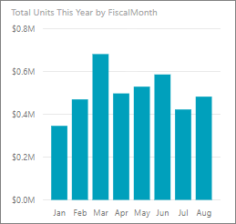

# Visuele KPI-elementen
Een Key Performance Indicator (KPI) is een visuele aanwijzing waarmee de voortgang naar een meetbaar doel wordt aangegeven. Zie [Microsoft Developer Network](https://msdn.microsoft.com/library/hh272050) voor meer informatie over KPI's.

Als u zich niet hebt geregistreerd voor Power BI, kunt u zich hier [aanmelden voor een gratis proefversie](https://app.powerbi.com/signupredirect?pbi_source=web) voordat u begint.

## Vereisten
* [Power BI Desktop - helemaal gratis](https://powerbi.microsoft.com/get-started/)
* [Het voorbeeld-PBIX-bestand Retail Analysis](http://download.microsoft.com/download/9/6/D/96DDC2FF-2568-491D-AAFA-AFDD6F763AE3/Retail%20Analysis%20Sample%20PBIX.pbix)

## Een KPI gebruiken
KPI's zijn een prima keuze:

* voor het meten van voortgang (waarmee loop ik voor of achter?)
* voor het meten van de afstand tot een doel (hoe ver loop ik voor of achter?)   

## KPI-vereisten
Een Key Performance Indicator (KPI) is gebaseerd op een specifieke meting en is ontworpen voor het evalueren van de huidige waarde en status van een metrieke waarde tegen een gedefinieerd doel. Daarom zijn voor een visueel KPI-element een *basismeting* vereist, waarmee een waarde en een *doelmeting* of doelwaarde worden bepaald, en een *drempelwaarde* of *doelstelling*.

Momenteel moet een KPI-gegevensset doelstellingswaarden voor een KPI bevatten. Als uw gegevensset geen doelstellingswaarde bevat, kunt u doelstellingen maken door een Excel-werkblad met doelstellingen aan uw gegevensmodel of PBIX-bestand toe te voegen.

## KPI's maken
Open het [bestand Retail Analysis.pbix](http://download.microsoft.com/download/9/6/D/96DDC2FF-2568-491D-AAFA-AFDD6F763AE3/Retail%20Analysis%20Sample%20PBIX.pbix) in Power BI Desktop. We maken een KPI die de voortgang meet die we hebben gemaakt bij een verkoopdoel.

Of kijk naar Will die laat zien hoe u eenvoudige metrische visuele elementen maakt: meters, kaarten en KPI's.

<iframe width="560" height="315" src="https://www.youtube.com/embed/xmja6EpqaO0?list=PL1N57mwBHtN0JFoKSR0n-tBkUJHeMP2cP" frameborder="0" allowfullscreen></iframe>

1. Open het rapport in de rapportweergave en selecteer het gele tabblad om een nieuwe pagina toe te voegen.    
2. Selecteer in het deelvenster Velden **Sales > Total Units This Year**.  Dit wordt de indicator.
3. Voeg **Time > FiscalMonth** toe.  Dit stelt de trend voor.
4. BELANGRIJK: sorteer de grafiek op **FiscalMonth**. Als u de visualisatie naar een KPI hebt omgezet, is er geen optie meer om te sorteren.

    
5. Zet het visuele element om naar een KPI door het KPI-pictogram in het deelvenster Visualisatie te selecteren.
   
    
6. Voeg een doelstelling toe. Voeg de verkopen van vorig jaar als doelstelling toe. Sleep **Totaal aantal eenheden vorig jaar** naar het veld **Doelstellingen**.
   
    
7. U kunt eventueel de KPI opmaken door het verfrollerpictogram te selecteren om het deelvenster Opmaak te openen.
   
   * **Indicator**: hiermee worden de weergave-eenheden en het aantal decimalen bepaald.
   * **Trendas**: als deze is ingesteld op **Aan** wordt de trendas weergegeven als achtergrond van het visuele KPI-element.  
   * **Doelstellingen**: als deze is ingesteld op **Aan** worden de doelstelling en de weg naar het doel als een percentage op het visuele element weergegeven.
   * **Kleurcodering > Richting**: sommige KPI's worden bij hogere waarden als *beter* beschouwd en sommige worden bij lagere waarden als *beter* beschouwd. Bijvoorbeeld omzet versus wachttijd. Meestal is een hogere waarde voor omzet beter versus een hogere waarde voor wachttijd. Selecteer **hoog is beter** en wijzig desgewenst de kleurinstellingen.

KPI's zijn ook beschikbaar in de Power BI-service en op uw mobiele apparaten, zodat u altijd een vinger aan de pols van uw bedrijf hebt.

## Aandachtspunten en probleemoplossing
* Als uw KPI niet lijkt op de hierboven afgebeelde KPI, kan dat komen omdat u op FiscalMonth moet sorteren. Omdat KPI's geen sorteeroptie hebben, moet u op FiscalMonthmaand sorteren *voordat* u uw visualisatie omzet in een KPI.

## Volgende stappen

[Basistoewijzingen in Power BI](power-bi-map-tips-and-tricks.md)

[Visualization types in Power BI](power-bi-visualization-types-for-reports-and-q-and-a.md) (Typen visualisaties in Power BI)