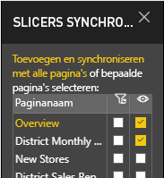
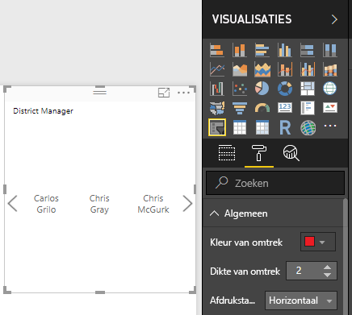
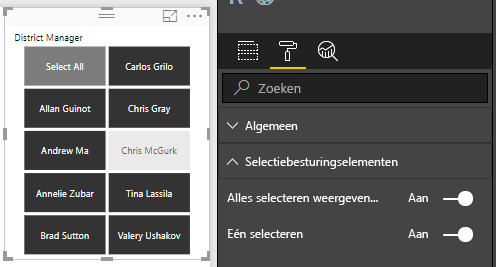
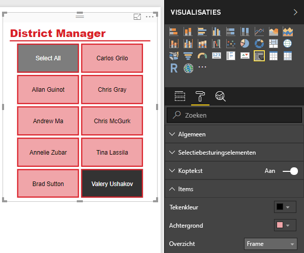

# Slicers in Power BI
U wilt dat de lezers van uw rapport de algemene metrische gegevens voor de verkoop kunnen bekijken, maar dat ze ook prestaties voor afzonderlijke districtmanagers en verschillende perioden kunnen markeren. U kunt aparte rapporten of vergelijkende grafieken maken of u kunt gebruikmaken van slicers. Een slicer is een alternatieve manier om te filteren. U beperkt hiermee het gedeelte van de gegevensset dat wordt weergegeven in de andere visualisaties in een rapport. 

In deze zelfstudie wordt gebruikgemaakt van het gratis [voorbeeld van een retailanalyse](../sample-retail-analysis.md) om u te helpen bij het maken, opmaken en gebruiken van lijst- en datumbereikslicers. Ontdek manieren om slicers op te maken en te gebruiken. 

## Een slicer gebruiken
Slicers zijn een goede keuze als u:

* veelgebruikte of belangrijke filters op het rapportcanvas wilt weergeven voor een eenvoudigere toegang;
* de huidige gefilterde status gemakkelijker wilt bekijken zonder dat u een vervolgkeuzelijst hoeft te openen; 
* wilt filteren op kolommen die niet nodig zijn en verborgen zitten in de gegevenstabellen;
* meer gerichte rapporten wilt maken door slicers naast belangrijke visuele elementen te zetten.

Slicers van Power BI hebben de volgende beperkingen:

- Slicers bieden geen ondersteuning voor invoervelden.
- Slicers kunnen niet worden vastgemaakt aan een dashboard.
- Detailweergave wordt niet ondersteund voor slicers.
- Slicers bieden geen ondersteuning voor filters op niveau van visuele elementen.

## Slicers maken

Voor het maken van een nieuwe slicer kunt u het slicerpictogram selecteren en selecteer vervolgens het gegevensveld te filteren op (of sleep het naar de **Filters** vak de **visualisaties** deelvenster), of u kunt selecteren of sleep het gegevensveld eerst naar Maak een visualisatie en selecteer vervolgens het slicerpictogram om in te schakelen van de visualisatie in een slicer. Met verschillende gegevenstypen worden verschillende typen slicers met verschillende effecten en opties gemaakt. 

Wanneer u een rapport voor de eerste keer wijzigt, wordt de knop voor **Standaardinstelling herstellen** geactiveerd. Dit helpt u eraan herinneren dat u de oorspronkelijke rapportinstellingen hebt gewijzigd. Als u weg navigeert van het rapport, wordt die wijziging opgeslagen (behouden). Wanneer u terugkeert naar het rapport hoeft u het rapport niet opnieuw te segmenteren.  Als u het rapport echter wilt terugzetten naar de standaardinstellingen van de auteur, selecteert u de knop **Standaardinstelling herstellen** in de bovenste menubalk.

> [!NOTE]
> Als de knop **Standaardinstelling herstellen** nog steeds uitgeschakeld is, betekent dit dat de auteur van het rapport de functie voor het rapport heeft uitgeschakeld of dat het rapport een aangepaste visual bevat. Beweeg de muisaanwijzer boven de knop om de knopinfo te lezen voor een uitleg. 

**Een nieuwe slicer maken om gegevens te filteren op Districtmanager**

1. Open in Power BI Desktop of Power BI-service, de [Retail Analysis Sample](../sample-retail-analysis.md). (Selecteer in de Power BI-service **Rapport bewerken** linksboven.)
2. Op de pagina overzicht met er niets is geselecteerd op het canvas, selecteer de **Slicer** pictogram  in de **visualisaties** deelvenster naar een nieuwe slicer maken. 
3. Met de nieuwe slicer is geselecteerd, in het deelvenster velden selecteren **District** > **DM** voor het vullen van de slicer. De nieuwe slicer is een lijst met selectievakjes vóór de namen. 
    
    
    
4. Vergroot of verklein en sleep de slicer en andere elementen op het canvas om ruimte voor de slicer te maken. Houd er rekening mee dat de slicer-items worden afgekapt als u de slicer te klein maakt. 
5. Selecteer namen op de slicer en bekijk wat de gevolgen voor de andere visualisaties op de pagina zijn. Selecteer namen opnieuw om de selectie van de namen ongedaan te maken en houd de toets **Ctrl** ingedrukt om meer dan een naam te selecteren. Als u alle namen selecteert, heeft dit hetzelfde effect als wanneer u geen naam selecteert. \

6. U kunt ook het pictogram met de verfroller om de opmaak van uw slicer selecteren. Er zijn gewoon te veel opties voor alle hier aan de orde - dus experimenteren en maken van een slicer of werkt voor u. De eerste slicer is geconverteerd naar een vervolgkeuzelijst om ruimte te besparen en de optie voor het 'Alles selecteren' is toegevoegd in de onderstaande voorbeelden.  De tweede slicer is geformatteerd met kleuren, lettertypen grootten, en kunt alleen een enkelvoudige selectie.

   
>[!TIP]
>Slicer-items in een lijst worden standaard in oplopende alfanumerieke volgorde gesorteerd. Als u de sorteervolgorde wilt wijzigen in aflopend, selecteert u het beletselteken ( **...** ) in de rechterbovenhoek van de slicer en kiest u **Sorteren op Districtmanager** in de vervolgkeuzelijst. 

**Een nieuwe slicer maken om gegevens te filteren op datumbereik**

1. Vervolgkeuzelijst met er niets is geselecteerd op het canvas, **datum** in het deelvenster velden en sleep **datum** naar de **waarden** vak in het deelvenster visualisaties om een nieuwe visualisatie te maken.
2. Selecteer de nieuwe visualisatie en selecteer het pictogram **Slicer** om de nieuwe visualisatie te converteren naar een slicer. Deze slicer is een schuifregelaar waarbij datumbereik is ingevuld.
    
    

    
4. Vergroot of verklein en sleep de slicer en andere elementen op het canvas om ruimte voor de slicer te maken. De grootte van de schuifregelaar wordt met de grootte van de slicer gewijzigd, maar de schuifregelaar verdwijnt en de datums worden afgekapt als u de slicer te klein maakt. 
4. Selecteer verschillende datumbereiken met de schuifregelaar, of selecteer een datumveld om een waarde te typen of geef een kalender weer om nauwkeuriger te selecteren. Bekijk de gevolgen voor de andere visualisaties op de pagina.
    
    >[!NOTE]
    >Het numerieke gegevenstype en het gegevenstype voor datum/tijd produceren standaard bereikslicers met een schuifregelaar. Vanaf de Power BI-update van februari 2018 worden bereikschuifregelaars van het gegevenstype Geheel getal nu uitgelijnd op gehele getallen in plaats van dat er decimalen worden weergegeven. 

5. Wijzig nu de waarde van het veld van **datum** naar **MonthIndex**.  Dit resulteert in een **tussen** schuifregelaar slicer type bereik standaard, maar u kunt dit wijzigen in andere slicertypen en selectieopties. Als u het slicertype wilt wijzigen terwijl de slicer is geselecteerd, houd u de muis boven het gebied rechtsboven van de slicer, breidt u het dakje uit dat wordt weergegeven, en kiest u een van de andere opties, zoals **Lijst** of **Voor**. Zoals u ziet, worden het uiterlijk van de slicer en de selectieopties gewijzigd. 
 
    

Bekijk de volgende video en zie [De slicer voor numeriek bereik in Power BI Desktop gebruiken](../desktop-slicer-numeric-range.md) voor meer informatie over het maken van slicers voor datum- en numerieke bereiken.
<iframe width="560" height="315" src="https://www.youtube.com/embed/zIZPA0UrJyA" frameborder="0" allowfullscreen></iframe> 

## Regelen welke visuals op de pagina worden beïnvloed door slicers
Slicers op rapportpagina's beïnvloeden standaard alle andere visualisaties op die pagina, met inbegrip van elkaar. Bekijk bij het kiezen van waarden in de lijst en datumschuifregelaars die u zojuist hebt gemaakt, de gevolgen voor de andere visualisaties. De gefilterde gegevens zijn een snijpunt van de waarden die in beide slicers zijn geselecteerd. 

U kunt **Visuele interacties** gebruiken om te voorkomen dat bepaalde visualisaties op de pagina worden beïnvloed door andere. Op de pagina **Overzicht** geeft de grafiek Totaal afwijkingspercentage verkoop per FiscalMonth en District Manager de algemene vergelijkende gegevens voor de districtmanagers per maand weer die te allen tijde zichtbaar moeten blijven. U kunt **Visuele interacties** gebruiken om te voorkomen dat slicerselecties deze grafiek filteren. 

1. Terwijl de slicer Districtmanager is geselecteerd:
    - Selecteer in Power BI Desktop het menu **Opmaak** onder **Visual Tools** en selecteer **Interacties bewerken**.
    - Kies in de Power BI-service **Visual interacties** in de menubalk en schakel **Interacties bewerken** in. 
   
   Besturingselementen voor filteren  verschijnen boven alle andere visuals op de pagina. In eerste instantie zijn alle **Filter**-pictogrammen geselecteerd.
   
2. Selecteer het pictogram **Geen** boven de grafiek **Totaal afwijkingspercentage verkoop per FiscalMonth en District Manager** om te stoppen dat deze door de slicer wordt gefilterd. 
3. Selecteer de slicer **Maand** en selecteer opnieuw het pictogram **Geen** boven de grafiek **Totaal afwijkingspercentage verkoop per FiscalMonth en District Manager** om te stoppen dat deze door de slicer wordt gefilterd. Als u nu namen en datumbereiken in de slicers selecteert, wordt de grafiek Totaal afwijkingspercentage verkoop per FiscalMonth en District Manager niet gewijzigd. 

Zie [Visuele interacties in een Power BI-rapport](../service-reports-visual-interactions.md) voor meer informatie over het bewerken van interacties.

## Slicers synchroniseren en op andere pagina's gebruiken
Met ingang van de Power BI-update van februari 2018 kunt u een slicer synchroniseren en deze op een of alle pagina's in een rapport gebruiken. 

In het huidige rapport heeft de pagina **Maandelijkse verkoop district** ook een slicer **Districtmanager**, maar wordt deze niet gesynchroniseerd met de slicer die u hebt gemaakt op de pagina **Overzicht** (de twee slicers kunnen verschillende itemselecties hebben). De pagina **Nieuwe winkels** heeft alleen een slicer **Winkelnaam**. U kunt uw nieuwe slicer **Districtmanager** naar deze pagina's synchroniseren, zodat slicerselecties op elke pagina invloed hebben op visualisaties op alle drie pagina's. 

1. Selecteer in het menu **Weergave** de optie **Slicers synchroniseren** in Power BI Desktop (of schakel het deelvenster **Slicers synchroniseren** in bij de Power BI-service). Het deelvenster **Slicers synchroniseren** wordt weergegeven. 
2. Selecteer op de pagina **Overzicht** de slicer **Districtmanager**. Zoals u ziet, is de pagina **Maandelijkse verkoop district** al geselecteerd in de kolom **Zichtbaar**, omdat er zich ook een slicer Districtmanager op deze pagina bevindt, maar is de pagina niet geselecteerd in de kolom **Synchroniseren**. 
    
    
    
3. Selecteer in de kolom **Synchroniseren** de pagina **Nieuwe winkels** en de pagina **Maandelijkse verkoop district** om de slicer **Overzicht** naar die pagina's te synchroniseren. 
    
3. Selecteer in de kolom **Zichtbaar** de pagina **Nieuwe winkels** en laat de pagina **Maandelijkse verkoop district** geselecteerd. 
4. Bekijk de gevolgen van het synchroniseren van de slicer en van het zichtbaar maken op de andere pagina's. Op de pagina **Maandelijkse verkoop district** laat de slicer **Districtmanager** nu dezelfde selecties zien als de slicer op de pagina **Overzicht**. Op de pagina **Nieuwe winkels** beïnvloeden de selecties in de slicer **Districtmanager** de selecties die beschikbaar zijn in de slicer **Winkelnaam**. 
    
    >[!TIP]
    >Hoewel de slicer in eerste instantie op de gesynchroniseerde pagina's wordt weergegeven met dezelfde grootte en positie als op de oorspronkelijke pagina, kunt u gesynchroniseerde slicers verplaatsen, groter of kleiner maken en opmaken op alle pagina's afzonderlijk. 

>[!NOTE]
>Als u een slicer naar een pagina synchroniseert, maar deze niet zichtbaar maakt op die pagina, filteren de slicerselecties op de andere pagina's nog steeds de gegevens op de pagina.
 
## Slicers opmaken
Er zijn verschillende opmaakopties beschikbaar, afhankelijk van het type slicer. Door de stand **Horizontaal**, de lay-out **Responsief** en kleuren voor **items** te gebruiken, kunt u knoppen of tegels produceren in plaats van standaardlijstitems en kunt u de grootte van slicer-items aanpassen voor verschillende schermgrootten en lay-outs.  

1. Selecteer, terwijl de slicer **Districtmanager** is geselecteerd op een pagina, in het deelvenster **Visualisaties** het pictogram **Opmaak**  om de opmaakbesturingselementen weer te geven. 
    
    
    
2. Selecteer de vervolgkeuzelijstpijlen naast elke categorie om de opties weer te geven en te bewerken. 

### Algemene opties
1. Selecteer rood bij de **kleur van omtrek** en wijzig **de dikte van omtrek** in '2'. Dit stelt de kleur en de dikte in van de omtrekken of onderstrepingen van kopteksten en items, wanneer deze zijn ingeschakeld. 
2. Onder **Stand** is **Verticaal** de standaardinstelling. Selecteer **Horizontaal** om een slicer te produceren met horizontaal gerangschikte tegels of knoppen en schuifpijlen voor toegang tot items die niet in de slicer passen.
    
    
    
3. Schakel de lay-out **Responsief** in om de grootte en rangschikking van slicer-items overeenkomstig viewscreen en slicergrootte te wijzigen. Voor de lijstslicer is de responsieve lay-out alleen beschikbaar in horizontale stand en wordt voorkomen dat items op kleine schermen worden afgekapt. Bij slicers met een bereikschuifregelaar wordt met de responsieve opmaak de stijl van de schuifregelaar gewijzigd en wordt er meer flexibiliteit voor vergroten of verkleinen geboden. Beide typen slicers worden filterpictogrammen bij zeer kleine grootten. 
    
    
    
    >[!NOTE]
    >Wijzigingen in de responsieve lay-out kunnen specifieke, door u ingestelde opmaak van kopteksten en items opmaak overschrijven. 
    
4. Stel de positie en grootte van de slicer in met numerieke precisie onder **X-positie**, **Y-positie**, **Breedte** en **Hoogte** of verplaats en wijzig de grootte van de slicer rechtstreeks op het canvas. Experimenteer met verschillende itemgrootten en rangschikkingen en bekijk hoe de responsieve opmaak dienovereenkomstig wordt gewijzigd.  

    

Zie [Een responsieve slicer maken waarvan u de grootte kunt wijzigen in Power BI](../power-bi-slicer-filter-responsive.md) voor meer informatie over de horizontale stand en responsieve lay-out.

### Opties voor selectiebesturingselementen (alleen lijstslicers)
1. **Alles selecteren weergeven** is standaard **uit**. Zet deze optie op **Aan** om het item **Alles selecteren** aan de slicer toe te voegen waarmee alle items worden geselecteerd of gedeselecteerd wanneer u omschakelt. Wanneer alle items zijn geselecteerd, wordt één item gedeselecteerd als u erop klikt of tikt, zodat u een 'is niet'-type filter krijgt. 
    
    
    
2. **Eén selecteren** is standaard **aan**. U selecteert een item door erop te klikken of tikken, en u selecteert meerdere items wanneer u bij het klikken of tikken **Ctrl** ingedrukt houdt. Zet **Eén selecteren** op **Uit** zodat u meerdere items kunt selecteren zonder **Ctrl** ingedrukt te hoeven houden. U deselecteert een item door opnieuw erop te klikken of tikken. 

### Opties voor Kopteksten
De **koptekst** is standaard **aan**, waarbij de naam van het gegevensveld aan de bovenkant van de slicer wordt weergegeven. 
1. Maak de koptekst zo op dat de **tekstkleur** rood, de **tekengrootte** 14 pt en **lettertypefamilie** Arial Black is. 
2. Kies onder **Omtrek** de optie **Alleen onder** om een onderstreping te krijgen met de grootte en de kleur die u hebt ingesteld onder de **algemene opties**. 

### Itemopties (alleen lijstslicers)
1. Maak de tekst en de achtergrond van items zo op dat de **tekstkleur** zwart, de **achtergrond** lichtrood, de **tekengrootte** 10 pt en de **lettertypefamilie** Arial is. 
2. Kies onder **Omtrek** de optie **Kader** om een rand om elk item te tekenen met de grootte en de kleur die u bij de **algemene opties** hebt ingesteld. 
    
    
    
    >[!TIP]
    >- Gedeselecteerde items tonen bij **Stand > Horizontaal** de gekozen tekst- en achtergrondkleuren, terwijl de geselecteerde items gebruikmaken van de systeemstandaard, doorgaans een zwarte achtergrond met witte tekst.
    >- Bij **Stand > Verticaal** tonen items altijd de ingestelde kleuren, en selectievakjes zijn altijd zwart wanneer deze zijn geselecteerd. 

### Datum- en numerieke invoer en schuifregelaarsopties (alleen slicers met een bereikschuifregelaar)
- De opties voor datum- en numerieke invoer zijn gelijk aan de **item**opties voor lijstslicers, maar er is geen **Omtrek** of onderstreping.
- Met opties voor de schuifregelaar kunt u de kleur van de bereikschuifregelaar instellen of de schuifregelaar instellen op **Uit**, zodat alleen de numerieke invoer wordt gehandhaafd.

### Overige opmaakopties
De overige opmaakopties zijn standaard uitgeschakeld. Indien **ingeschakeld**: 
- **Titel:** Hiermee wordt een titel toegevoegd en opgemaakt (naast en onafhankelijk van de koptekst) aan de bovenkant van de slicer. 
- **Achtergrond:** Hiermee wordt een achtergrondkleur toegevoegd aan de algehele slicer en wordt de transparantie ingesteld.
- **Hoogte-breedteverhouding vergrendelen:** Hiermee wordt de vorm van de slicer behouden als de grootte ervan wordt gewijzigd.
- **Rand:** Hiermee wordt een rand van 1-pixel rondom de slicer toegevoegd en wordt de kleur ervan ingesteld. (Deze slicerrand valt niet onder en wordt niet beïnvloed door de algemene omtrekinstellingen.) 

## Volgende stappen
[Visualization types in Power BI](power-bi-visualization-types-for-reports-and-q-and-a.md) (Typen visualisaties in Power BI)

[Tabellen in Power BI](power-bi-visualization-tables.md)

