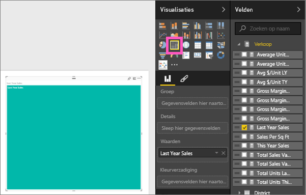
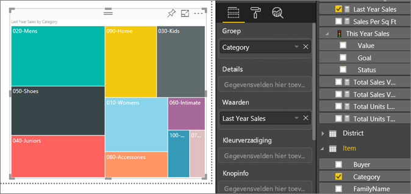

# Treemaps in Power BI
In treemaps worden hiërarchische gegevens weergegeven als een set van geneste rechthoeken.  Elk niveau van de hiërarchie wordt weergegeven als een gekleurde rechthoek (ook wel een vertakking genoemd) die andere gekleurde rechthoeken (bladeren) bevat.  De ruimte in elke rechthoek wordt toegewezen op basis van de waarde die wordt gemeten. En de rechthoeken zijn gerangschikt op grootte van linksboven (grootste) naar rechtsonder (kleinste).

Als ik bijvoorbeeld mijn verkopen analyseer, heb ik mogelijk rechthoeken op het bovenste niveau, ook wel *vertakkingen* genoemd, voor de volgende kledingcategorieën: **Urban**, **Landelijk**, **Jeugd** en **Mix**.  Mijn categorierechthoeken worden opgedeeld in kleinere rechthoeken, ook wel *bladeren* genoemd, voor de kledingfabrikanten binnen die categorie. En deze kleinere rechthoeken worden in grootte aangepast en gearceerd op basis van het aantal verkochte items.  

In de vertakking **Urban** is er veel kleding van `Maximus` verkocht, minder van `Natura` en `Fama`, en weinig `Leo`.  Dus de vertakking **Urban** van mijn Treemap heeft:
* de grootste rechthoek voor `Maximus` in de linkerbovenhoek
* iets kleinere rechthoeken voor `Natura` en `Fama`
* veel andere rechthoeken voor alle andere verkochte kleding, en 
* een heel klein rechthoekje voor `Leo`.  

En ik kan het aantal verkochte items vergelijken met andere kledingcategorieën door de grootte en inkleuring van elk bladknooppunt met elkaar te vergelijken. Hoe groter de rechthoek en hoe donkerder de kleur, hoe hoger de waarde.

## Wanneer u een treemap gebruikt
In de volgende gevallen komen treemaps goed van pas:

* Wanneer u grote hoeveelheden hiërarchische gegevens moet weergeven.
* Wanneer een staafdiagram het grote aantal waarden niet effectief kan verwerken.
* Wanneer u de verhoudingen tussen de verschillende en het geheel wilt weergeven.
* Wanneer u het patroon van de distributie van de meting tussen de verschillende niveaus van categorieën in de hiërarchie wilt weergeven.
* Wanneer u kenmerken wilt weergeven met grootte- en kleurcoderingen.
* Wanneer u patronen, uitbijters, de belangrijkste bijdragers en uitzonderingen wilt identificeren.

### Vereisten
 - Power BI-service of Power BI Desktop
 - Voorbeeld van een retailanalyse

## Een eenvoudige treemap maken
Wilt u eerst kijken hoe iemand anders een treemap maakt?  Ga naar 2:10 in deze video om te kijken hoe Amanda een treemap maakt.

<iframe width="560" height="315" src="https://www.youtube.com/embed/IkJda4O7oGs" frameborder="0" allowfullscreen></iframe>

U kunt ook zelf een treemap maken. In deze instructies wordt het voorbeeld van een retailanalyse gebruikt. Meld u aan bij de Power BI-service als u de zelfstudie wilt volgen. Selecteer achtereenvolgens **Gegevens ophalen \> Voorbeelden \> Voorbeeld van een retailanalyse \> Verbinding maken \> Naar dashboard gaan**. Visualisaties maken in een rapport vereist bewerkingsmachtiging voor de gegevensset en het rapport. Gelukkig zijn voorbeelden van Power BI bewerkbaar. Maar u kunt geen visualisaties toevoegen aan een rapport dat iemand met u heeft gedeeld.  

1. Selecteer de tegel 'Total stores' (Totaal aantal winkels) om het rapport Voorbeeld van een retailanalyse te openen.    
2. Open de [bewerkingsweergave](../service-interact-with-a-report-in-editing-view.md) en selecteer de meting **Verkoop** > **Omzet afgelopen jaar**.   
      
3. Converteer de grafiek naar een treemap.  
      
4. Sleep **Item** > **Categorie** naar de bron **Groep**. Er wordt een treemap in Power BI gemaakt waarbij de grootte van de rechthoeken is gebaseerd op de totale omzet en de kleur een categorie vertegenwoordigt.  In wezen hebt u een hiërarchie gemaakt die op visuele wijze de relatieve grootte van het totale aantal verkopen per categorie beschrijft.  De categorie **Heren** is de categorie met de meeste verkopen en de categorie **Kousen** is de categorie met de minste verkopen.   
      
5. Sleep **Winkel** > **Keten** naar de bron **Details** om uw treemap te voltooien. U kunt nu de omzet van het afgelopen jaar vergelijken op basis van de categorie en de keten.   
   
   
   > [!NOTE]
   > Kleurverzadiging en Details kunnen niet tegelijkertijd worden gebruikt.
   > 
   > 
5. Beweeg de cursor over het gebied **Keten** om de knopinfo voor dat gedeelte van de **Categorie** weer te geven.  Als u bijvoorbeeld de muisaanwijzer boven **Fashions Direct** in de rechthoek **090-startpagina** houdt, ziet u in de knopinfo het aandeel van Fashions Direct in de categorie Home.  
   
6. [Voeg de treemap toe als een dashboardtegel (de visual vastmaken)](../service-dashboard-tiles.md). 
7. [Sla het rapport op](../service-report-save.md).

## Markeren en kruislings filteren
Zie [Een filter aan een rapport toevoegen](../power-bi-report-add-filter.md) voor meer informatie over het gebruik van het deelvenster Filters.

Wanneer u een categorie of detail in een treemap markeert, worden de andere visualisaties op de rapportpagina kruislings gemarkeerd en gefilterd en omgekeerd. Als u wilt meelezen, voegt u enkele visuals toe aan deze rapportpagina of kopieert u de Treemap naar een van de andere niet-lege pagina’s van dit rapport.

1. Selecteer op de treemap een Categorie of Keten in een Categorie.  Hiermee worden de andere visualisaties op de pagina kruislings gemarkeerd. Als ik bijvoorbeeld **050-Schoenen** selecteer, kan ik zien dat er het afgelopen een omzet van $ 3.640.471 is gedraaid, waarvan $ 2.174.185 afkomstig was van Fashions Direct.  
   

2. Als u in het cirkeldiagram **Omzet afgelopen jaar per keten** het segment **Fashions Direct** selecteert, wordt de treemap kruislings gefilterd.  
       

3. Zie [Visualisatie-interacties in een Power BI-rapport](../service-reports-visual-interactions.md) als u wilt beheren hoe grafieken elkaar kruislings markeren en filteren.

## Volgende stappen

[Watervalgrafieken in Power BI](power-bi-visualization-waterfall-charts.md)

[Visualization types in Power BI](power-bi-visualization-types-for-reports-and-q-and-a.md) (Typen visualisaties in Power BI)